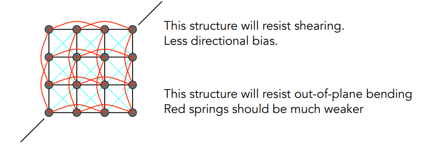

### 动画

电影：24 frams per second

video：30 fps

VR：90 fps

### 关键帧动画

画出主要动作（关键帧），再在其中填充过渡帧。

Flash：自动生成过渡帧

本质上就是一种插值的技术。

### 物理模拟/仿真

动画 =  物理模拟+后期渲染

模拟只计算运动之类的，渲染得到色彩

牛顿定律：$$F=ma$$

### 质点弹簧系统

可以完成：

- 头发模拟
- 布料

$$
f_{a\rightarrow b}=k_s\frac{\mathbf{b}-\mathbf{a}}{\left\| \mathbf{b}-\mathbf{a} \right \|}(\left\| \mathbf{b}-\mathbf{a} \right \|-l)
$$
由于能量守恒，运动不会停止

加入一个摩檫力 damping ：$f=-k_d\dot{b}$

**无法表征内部的损耗**
$$
f_b=-k_d\frac{\mathbf{b}-\mathbf{a}}{\left\| \mathbf{b}-\mathbf{a} \right \|}(\dot{b}-\dot{a})\cdot\frac{\mathbf{b}-\mathbf{a}}{\left\| \mathbf{b}-\mathbf{a} \right \|}
$$
沿着ab方向的力才会导致损耗（避免矩）。上式只是一种damping

#### 弹簧结构

**切变**：

### 其他系统

有限元：适合有力传导的系统；较复杂

### 粒子系统

比如烟雾之类的

