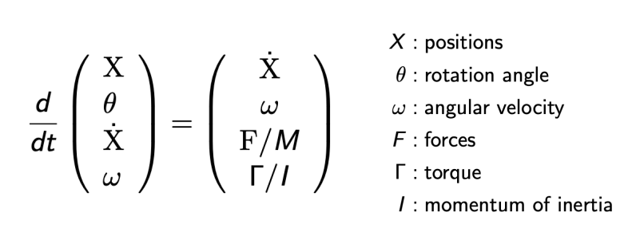

### 常微分方程

显示欧拉

隐式欧拉

龙格库塔法

#### position-based/ Verlet integration

假定弹簧被拉开后会立刻会原位；

**非物理的简化，计算速度快**

### 刚体模拟

### 流体仿真

#### position-based method

#### 欧拉（网格法）与拉格朗日（质点法）

#### material point method （MPM）

混合欧拉和拉格朗日方法

- 拉格朗日：考虑粒子具有属性
- 欧拉：用网格做数值积分
- interaction：粒子移动到网格，更新网格，再回到粒子