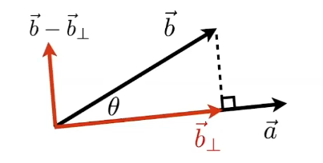

### 点积

默认矢量为列向量（便于左乘）。
$$
\vec{a}\cdot\vec{b}=\left \| \vec{a}\right\|\left \| \vec{b}\right\|cos\theta\\
\theta = \frac{\vec{a}\cdot\vec{b}}{\left \| \vec{a}\right\|\left \| \vec{b}\right\|}
$$
CG中便于计算夹角$\theta$。
$$
\vec{a}\cdot\vec{b}=\begin{pmatrix} x_a \\ y_a \\z_a\\ \end{pmatrix}\begin{pmatrix} x_b \\ y_b\\z_b \\ \end{pmatrix}
=x_a x_b+y_a y_b + z_a z_b
$$

#### 投影夹角

计算$\vec{b}$在$\vec{a}$上的投影$\vec{b}_{\perp}$。
$$
\vec{b}_{\perp} = k\hat{a}\\
k=\left\|\vec{b}_{\perp}\right\| = \left\|\vec{b}\right\|cos\theta
$$
$\hat{a}$为a方向的单位向量。

**计算垂直方向**：分解矢量

**计算两个向量是否接近**

**决定前向和后向**：正负，即$cos\theta$。

### 叉积

- 叉积垂直于两个向量（所在平面）
- 方向由右手螺旋定则决定
- 建立三维坐标系（右手坐标系）

$$
\vec{x}\times\vec{y}=+\vec{z}\\
\vec{y}\times\vec{z}=+\vec{x}\\
\vec{z}\times\vec{x}=+\vec{y}\\
\vec{a}\times(\vec{b}+\vec{c})=\vec{a}\times\vec{b}+\vec{a}\times\vec{c}
$$

$$
\vec{a}\times\vec{b}=\begin{pmatrix} x_a \\ y_a\\z_a \\ \end{pmatrix}\begin{pmatrix} x_b \\ y_b\\z_b \\ \end{pmatrix}
=\begin{pmatrix} y_a z_b-y_b z_a \\ z_a x_b-x_a z_b\\x_a y_b-y_a x_b \\ \end{pmatrix}
$$

#### 用途

- 判定左右：$\vec{a}\times\vec{b}>0$，则b在a左侧；
- 判定内外：判断点p与ABC三个顶点组成的矢量在ABC三顶点矢量的左边（或右边）；光栅化的基础

### 矩阵

**镜像矩阵**
$$
\begin{pmatrix} -1 & 0 \\ 0 & 1 \\ \end{pmatrix}
\begin{pmatrix} x \\ y \\ \end{pmatrix} =
\begin{pmatrix} -x \\ y \\ \end{pmatrix}
$$
**转置**
$$
(AB)^T=B^T A^T
$$

$$
(AB)^{-1}=B^{-1} A^{-1}
$$

### 向量乘法的矩阵形式

$$
\vec{a}\cdot\vec{b}=\vec{a}^T\vec{b}
$$

$$
\vec{a}\times\vec{b}=A*b=\begin{pmatrix} 0 & -z_a & y_a \\ z_a & 0 & -x_a\\-y_a & x_a & 0 \\ \end{pmatrix} \begin{pmatrix} x_b \\ y_b\\z_b \\ \end{pmatrix}
$$

