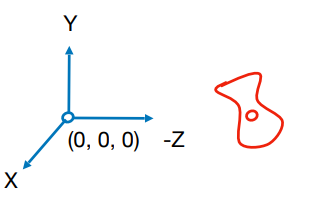
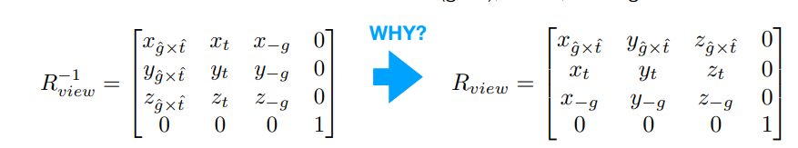
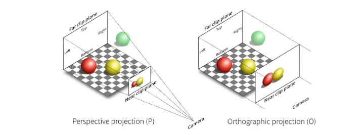
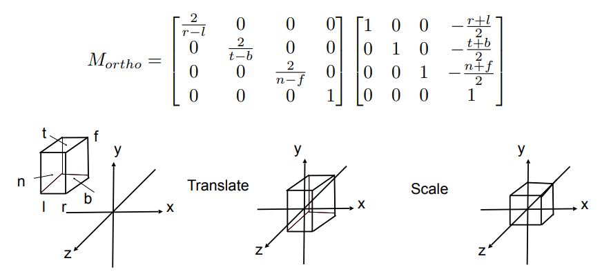

## view/camera  transformation

定义相机：

- 向上的向量$\vec{t}$
- look方向向量$\vec{g}$
- 位置$\vec{e}$

定义一个观测系统：假定位于原点；

位于原点(0,0,0)，向-z方向看，向上是Y。

步骤：

$$M_{view}=R_{view}T_{view}$$

- 移动到原点$T_{view}$
- 旋转g到-Z(0,0,-1)，t到Y(0,1,0)， g叉乘t到X(1,0,0)
  - 逆矩阵好写：X到g叉乘t；Y到t，-Z到g；
  - 由逆矩阵求旋转矩阵（正交矩阵）。

## 投影变换

- 3D to 2D
- 正交投影：保持平行；（多用于工程制图）；假定相机无限远。
- 透视投影：近大远小；不再平行

### 正交投影

- 可以丢弃z方向（理解为沿Z平移）

把立方体变为原点处的正方体。

矩阵里的2是因为最后的正方体范围是[-1,1]。

### 透视投影

前提：

- (x,y,z)和(kx,ky,kz,k)是同一个点（k!=0)

步骤：

- 缩放平面获得长方体：相似三角形计算变换矩阵
  - $$M_{persp\rightarrow ortho}= \begin{pmatrix} n&0&0&0\\0&n&0&0\\?&?&?&?\\0&0&1&0 \end{pmatrix} $$
    - 如何计算z方向变换，利用近平面计算。
- 正交投影

