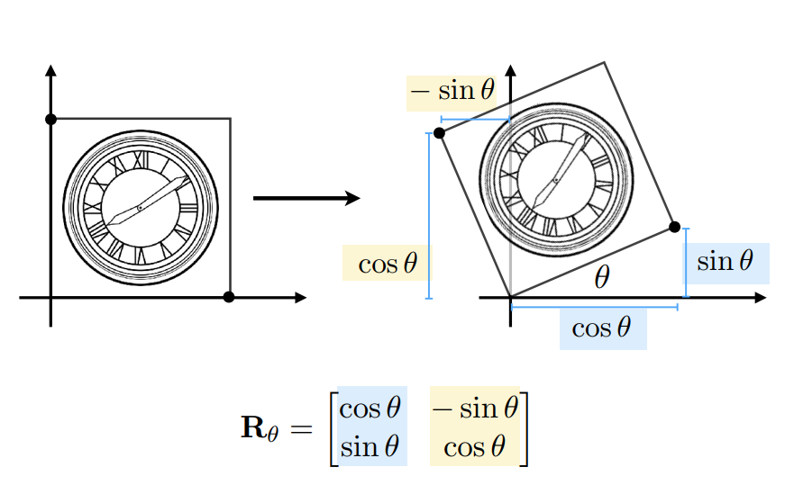
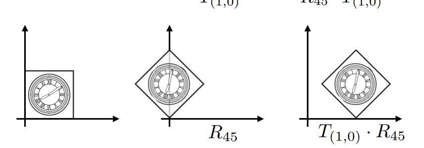
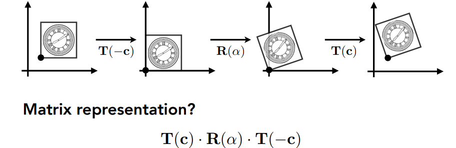
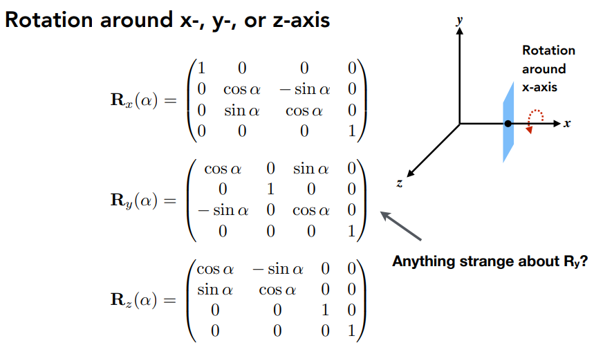

### 变换

- 尺度变换（均匀与非均匀）$$\begin{pmatrix} x' \\y' \\ \end{pmatrix} = \begin{pmatrix} s_x & 0 \\0 & s_y \\ \end{pmatrix} \begin{pmatrix} x \\y \\ \end{pmatrix} $$

- 反射矩阵：$$\begin{bmatrix} x' \\y' \\ \end{bmatrix} = \begin{bmatrix} -1 & 0 \\0 & 1 \\ \end{bmatrix} \begin{bmatrix} x \\y \\ \end{bmatrix} $$

- 切变矩阵：$$\begin{bmatrix} x' \\y' \\ \end{bmatrix} = \begin{bmatrix} 1 & tan\theta \\0 & 1 \\ \end{bmatrix} \begin{bmatrix} x \\y \\ \end{bmatrix} $$

- 旋转（假定**绕原点逆时针**）：

$$
R_{-\theta} = \begin{pmatrix} cos\theta & sin\theta \\-sin\theta & cos\theta \\ \end{pmatrix}
$$

$$
R_{-\theta} = R^T_\theta
$$
因为旋转$-\theta$是转换$\theta$的逆运算，所以
$$
R_{-\theta} =R^{-1}_\theta\\
R_{\theta}^T =R^{-1}_\theta
$$
所以$R_{\theta}$是正交矩阵

#### 线性变换

$$
\begin{bmatrix} x' \\y' \\ \end{bmatrix} = \begin{bmatrix} a & b \\c & d \\ \end{bmatrix} \begin{bmatrix} x \\y \\ \end{bmatrix}
$$

$$
\mathbf{x'} = \mathbf{Mx}
$$

**平移变换**：$$\begin{bmatrix} x' \\y' \\ \end{bmatrix} = \begin{bmatrix} 1 & 0 \\0 & 1 \\ \end{bmatrix} \begin{bmatrix} x \\y \\ \end{bmatrix} + \begin{bmatrix} t_x \\t_y \\ \end{bmatrix}$$

**平移变换不是线性变换**！

### 齐次坐标

对于二维问题，可以增加一个维度来表示

- 2D point = $(x,y,1)^T$
- 2D vector = $(x,y,0)^T$：向量具有平移可变性，所以没有平移变换。

$$
\begin{bmatrix} x' \\y' \\w' \\ \end{bmatrix} = \begin{bmatrix} 1 & 0 &t_x\\0 & 1 &t_y\\0&0&1 \\ \end{bmatrix} \begin{bmatrix} x \\y\\1 \\ \end{bmatrix}
$$

尾数1和0可以保证点和矩阵之间的加减性质不变。

- vector + vector = vector

- point – point = vector  

- point + vector = point  

- point + point = （中点）

#### 仿射变换

平移+变换
$$
\begin{bmatrix} x' \\y' \\1 \\ \end{bmatrix} = \begin{bmatrix} a & b &t_x\\c & d &t_y\\0&0&1 \\ \end{bmatrix} \begin{bmatrix} x \\y\\1 \\ \end{bmatrix}
$$
**代价**：引入额外数字，

### 组合变换

#### 变换合成

旋转+仿射

不能调换顺序；即矩阵乘法不满足交换律
$$
\begin{bmatrix} x' \\y' \\1 \\ \end{bmatrix} =T_{(1,0)}\cdot R_{45}\begin{bmatrix} x \\y \\1 \\ \end{bmatrix}= \begin{bmatrix} 1 & 0 &1\\0 &1 &0\\0&0&1 \\ \end{bmatrix}\begin{bmatrix} cos45^\circ & -sin45^\circ &0\\sin45^\circ & cos 45^\circ &0\\0&0&1 \\ \end{bmatrix} \begin{bmatrix} x \\y\\1 \\ \end{bmatrix}
$$
多次变化：
$$
A_n(\dots A_2(A_1(x))) = A_n\cdots A_2\cdot A_1\cdot \begin{pmatrix} x \\y \\1 \\ \end{pmatrix} 
$$
A一直是3x3的矩阵。可以把所有A累乘，还是一个3X3矩阵。

#### 变换分解

如何以右下角点旋转？转换为简单的

平移到原点 -->  旋转 --> 平移到原来位置

### 3D transformations

- 3D point = $(x,y,z,1)^T$
- 3D vector = $(x,y,z,0)^T$

$(x,y,z,w)$表示三维中的一个点$(x/w,y/w,z/w)$

#### 旋转（绕轴旋转）

注意y轴旋转的角度不同

#### 通用旋转

分解为绕轴旋转的组合。可以证明
$$
R_{xyz}(\alpha,\beta,\gamma) = R_x(\alpha)R_y(\beta)R_z(\gamma)
$$
罗德里格斯旋转公式

旋转轴$\mathbf{n}$（起点为原点，或者平移到原点），角度为$\alpha$

