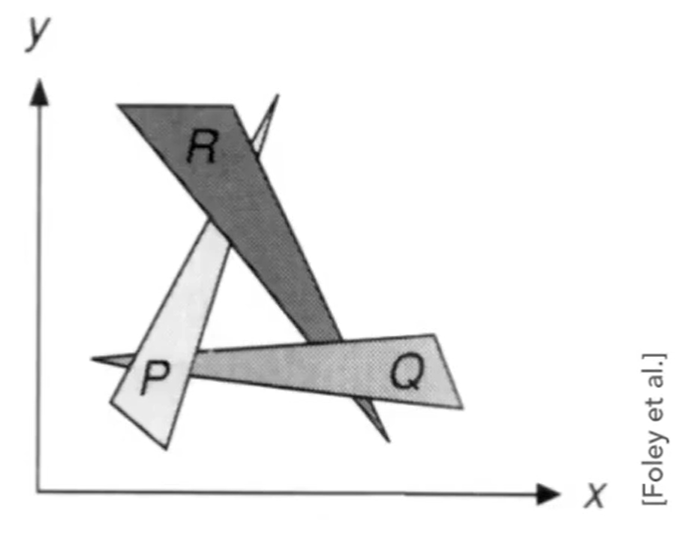

### 采样

定义：把函数离散化；利用**像素中心**对**屏幕空间**采样。

**判断**像素点是否在组成图像的多边形里(比如三角网格)

- 使用叉积
- 点在边上：任意标准都行

#### 改进算法

1. 先得到三角形包围核，然后值判断包围核中的点是否在三角形内。

2. 找每一行最左和最右的点：适用于面积小但包围核大的三角形

#### 真实屏幕

Bayer pattern：

### 反走样

采样：时间和空间上

物理实质：不同信号采样后得到相同的采样结果

#### 走样

- Jaggies：（空间）锯齿
- Moire patterns：减采样导致变化纹路
- Wagon Wheel illusion：（时间）视觉错误
- ……

原因：采样跟不上信号变化

#### 反走样

先模糊（卷积）再采样

即先对高频做滤波（低通滤波）

**模糊的结果**

#### 滤波

filtering=convolution（=averaging）

空间卷积=频域乘积

#### 采样

时域乘积=频域卷积。

频率上，采样就是重复原信号的频谱

采样：

- 时域：原信号乘以冲激信号
- 频域：原信号卷积冲激信号的频谱

#### 走样在频率的解释

采样不够快时，原始信号重复的频谱之间的间隔很小

反走样

#### antialiasing by supersampling（MSAA）

如何模糊？

把一个像素分为nxn的像素；

注意：不是提高采样率来反走样，而是用于计算三角形的覆盖（概率）

**实际使用**

不是规则的nxn像素，而是不规则图案。

其他方案：

- FXAA（Fast Approximate AA)：找到边界，用无锯齿的图形替换
- TAA（Temporal AA）：复用上一帧的结果（针对静止物体）

#### 超分辨率

- 从低分辨率恢复出高分辨率
- DLSS（Deep Learning Super Sampling）

### 画家算法

sort：从远到近开始绘制（覆盖）

### Z-Buff

问题：

除了正常绘制图像，还存储Z的深度

深度z：点到摄像机的距离，小表示距离近。

算法复杂度：$O(n)$，仅仅对每个像素求最小值，无需所有的顺序。

