### 纹理映射

把属性定义在任意一点上

三维物体的表面是二维的。

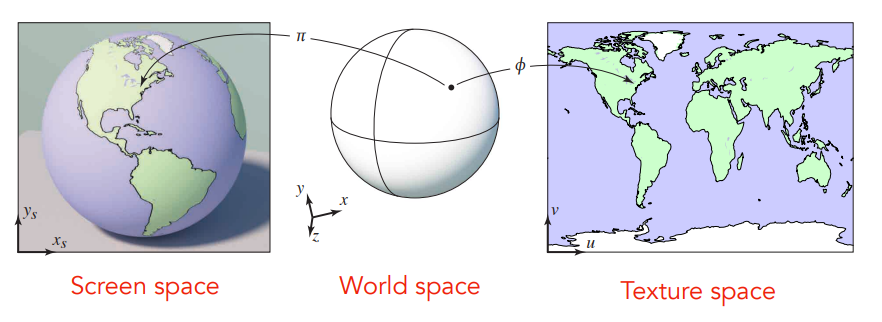

纹理可以认为就是一张图。

步骤：

- 绘制出纹理
- 纹理映射关系，（三维到二维）展开（保证相对关系）

#### 纹理坐标系

用$(u,v)$表示，假定展开后是矩阵。

多个局部坐标系。（纹理本身是周期性的，表现形式为无缝衔接）tiled。

#### 插值

重心坐标系(Barycentric Coordinates)：三角形内任意一点可以用其三个顶点表示。
$$
(x,y)=\alpha A+\beta B + \gamma C\\
\alpha + \beta +\gamma = 1; \quad \alpha\ge 0,\beta\ge 0,\gamma\ge 0
$$
只有两个自由度（另一个可由另两个表示）。

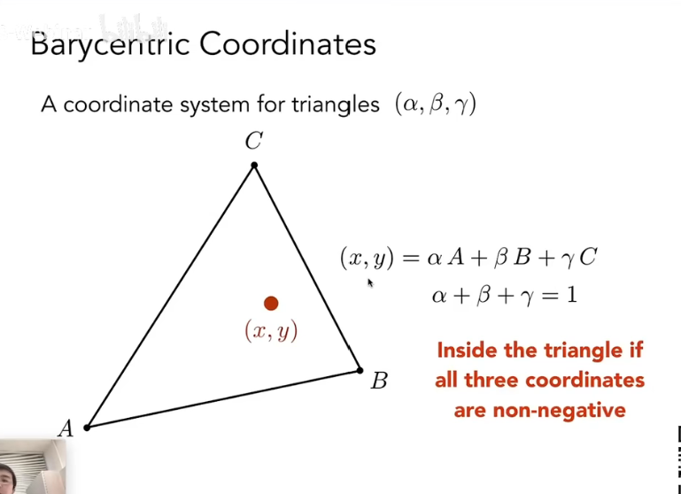

**求解系数**

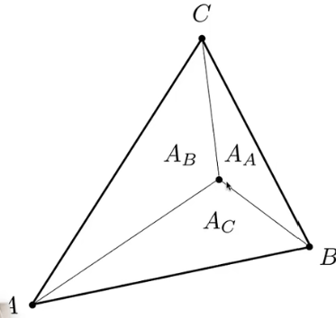
$$
\alpha = \frac{A_A}{A_A+A_B+A_C}\\
\beta  = \frac{A_B}{A_A+A_B+A_C}\\
\gamma = \frac{A_C}{A_A+A_B+A_C}\\
$$
对于三角形的**重心**：$$(\alpha,\beta,\gamma)=(1/3,1/3,1/3)$$。

**实际系数计算方法**：
$$
\alpha=\frac{-(x-x_B)(y_C-y_B)+(y-y_B)(x_C-x_B)}{-(x_A-X_B)(y_C-y_B)+(y_A-y_B)(x_C-x_B)}\\
\beta=\frac{-(x-x_C)(y_A-y_C)+(y-y_C)(x_A-x_C)}{-(x_B-x_C)(y_A-y_C)+(y_B-y_C)(x_A-x_C)}\\
\gamma = 1-\alpha -\beta
$$
**用途**

坐标点的属性也可以用三个顶点的属性线性组合。

投影后三个系数可能会改变（没有**投影不变**的性质）。

### Texture magnification

texel：纹理元素。

#### 插值

背景分辨率高，纹理分辨率低。

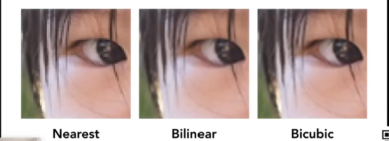

**双线性插值**(Bilinear)：先水平方向线性插值，再垂直方向线性插值。

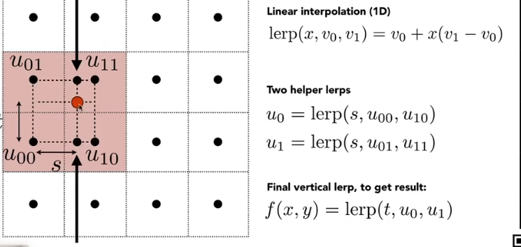

**双曲插值**(BIcubic)：取周边16个点，每次取4个点做三次插值；

#### 下采样（更困难）

纹理比背景分辨率高；摩尔纹和锯齿问题。

点查询 vs 范围查询

#### mipmap

范围查询（快、近似、方形），只需要比原来多1/3存储空间。

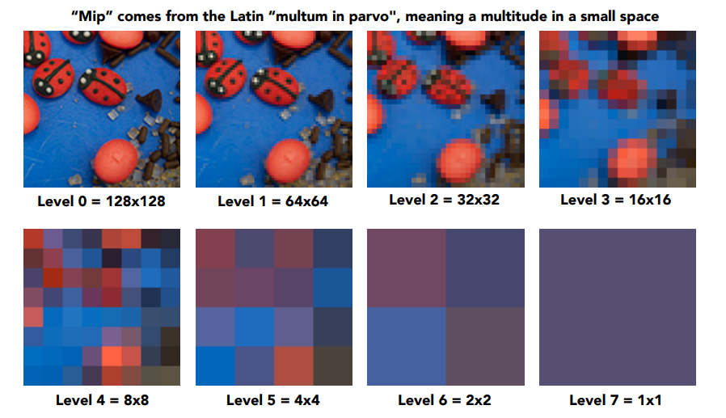

先得到下采样的结果，再（通过投影变换计算L）计算需要查询的像素点位于第几层(D)，即可根据点坐标得到对应的值。（近处层次低，远处层次高）

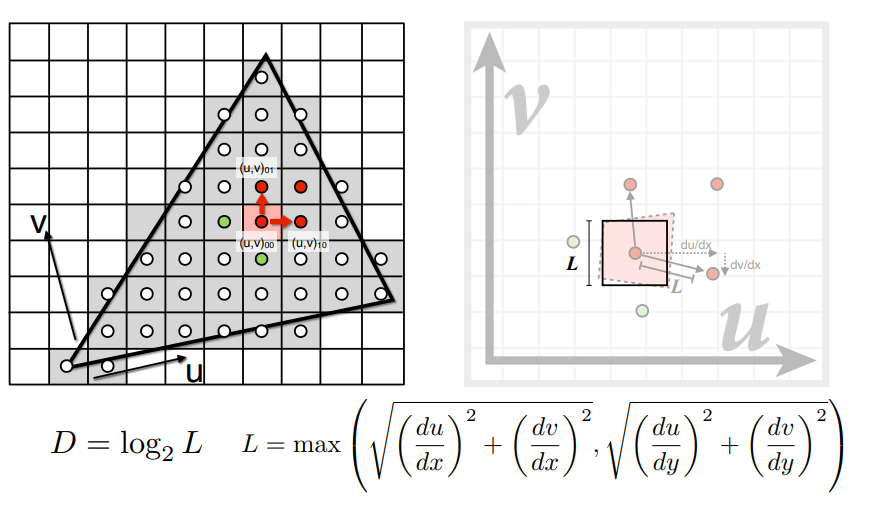

level1.8? 插值！

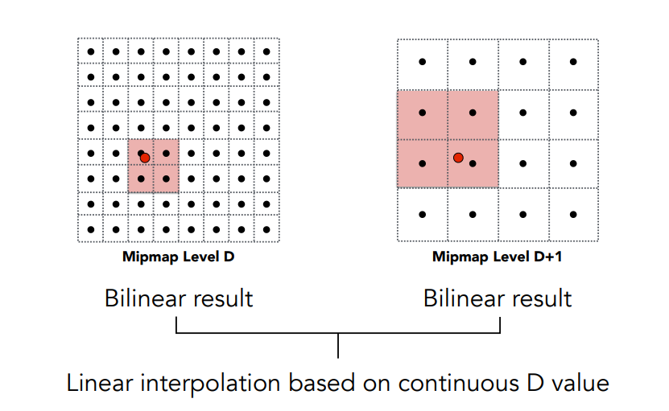

**局限性**：overblur

- 方块限制

**解决方案**：

各向异性过滤（anisotropic filtering）：不同方向压缩率不同。

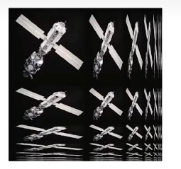

额外存储空间更大、更多查询次数

### environment map

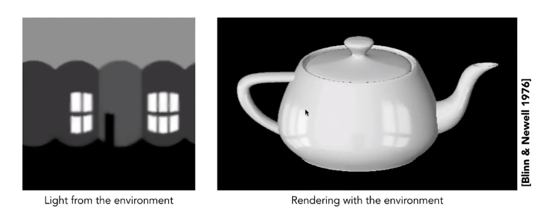

环境贴图：记录所有的环境光照信息；用纹理描述。

假定：环境光来自无限远处；同一方向的光 强度一致；

spherical球状环境贴图：把环境光记录在球上（可以展开）。

cubic记录于六面体（立方体）各个面上。

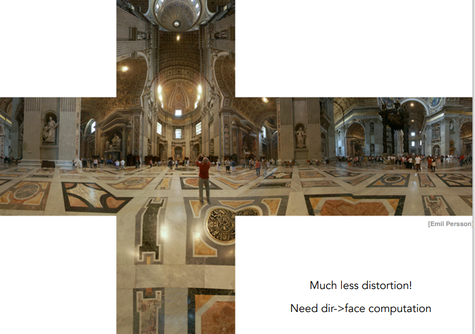

#### 凹凸贴图/法线贴图

存储法线和方向用于着色？这样得到的结果表面表现更加丰富、细致，更加接近物体在自然界本身的模样

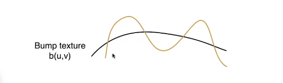

黑线是原本的物体表面，对其做扰动（黄线），改变法线。

求法线：先求梯度，梯度的垂直方向即法线（梯度转90度）。

进一步：**位移贴图**

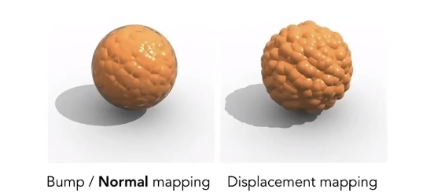

#### 3D造型噪声+固体模型

产生裂缝纹理等。

纹理保存阴影：计算环境阴影，加入纹理，再贴图。

#### volume rendering

3D纹理

