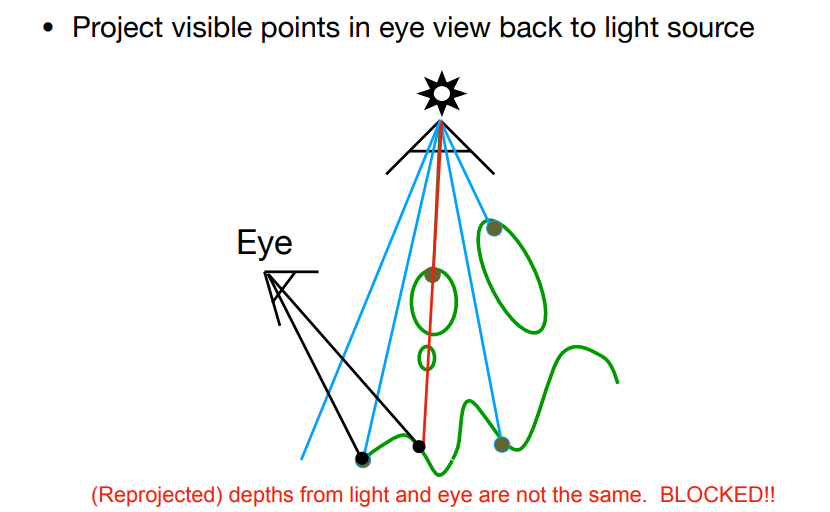
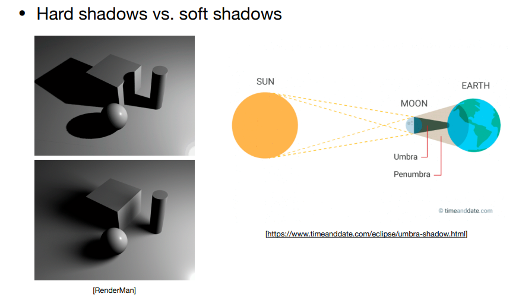

### shadow mapping

图像空间算法

- 无需场景的几何信息
- 走样
- 局限于点光源

关键点：

- 不在阴影的点：光源和视角都能看到该点
- 阴影点：只有你的视角能够看到

#### pass1 render from light

获得深度图

#### pass 2A from eye

把从视角看到的点 **投影**回光源，找到对应路径

#### pass 2B

对比深度不一致则为阴影。

**锯齿阴影**：

#### 软阴影

光源不是点，而是有大小。

#### 阴影分辨率

