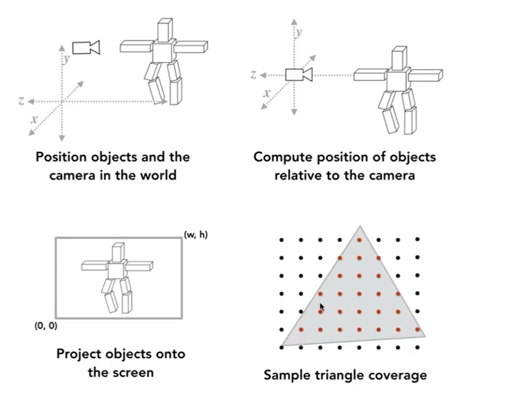
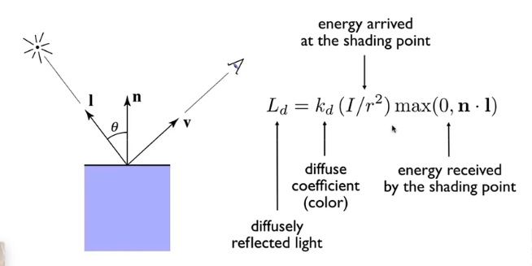
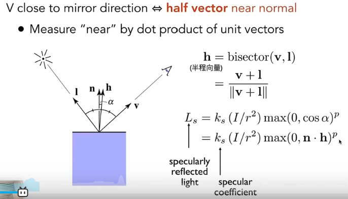
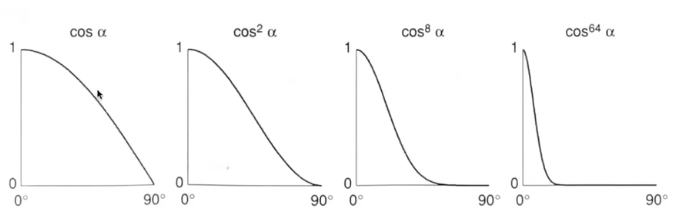
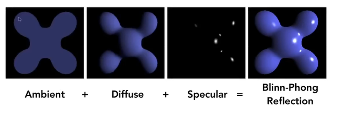
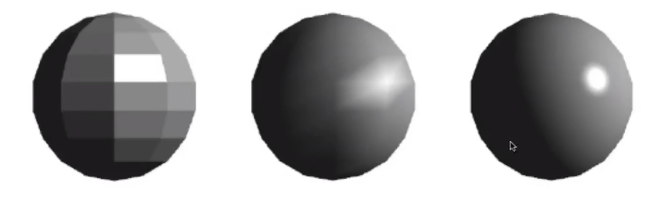
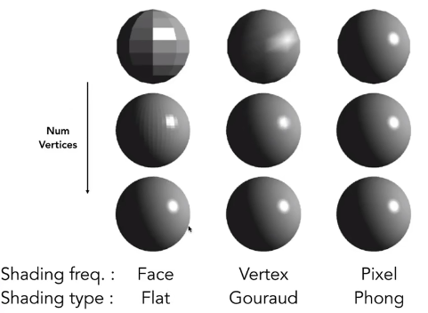
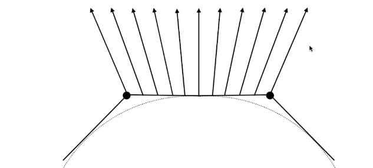
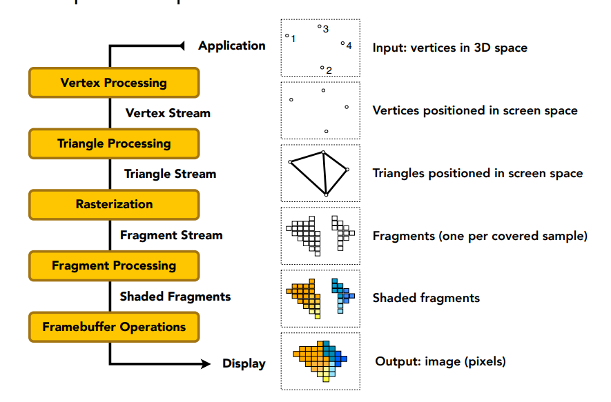

### 着色流程

## Blinn-Phone 着色模型

### 漫反射diffuse

与视角v无关。

### 高光specular

近似镜面反射，观察方向和镜面反射方向接近（小夹角）--> 半程向量（光线于视线夹角一半方向上的单位向量）与法线方向接近。（没考虑吸收）

**p参数使得高光尽量集中于几个角度里**；

### 环境光

假设：

- 任何一个点收到的环境光强度一致
- 环境光系数也一样；

即为常数；

### 着色频率

左（flat shading）：对一个面计算着色

中（Gouraud shading）：对每一个顶点着色计算，对顶点着色，再用插值方法在三角形内（三个点构成的）插值。

右（Phone shading）：像素点着色计算

着色频率的效果取决于模型复杂度

**顶点的法线？**

- 看作球上的点。
- 实际计算：相邻（多个）面法线的**平均**；（进一步考虑相邻面的面积作为权重）

**顶点间过渡法线**

### Graphics pipeline

实时渲染管线

1. 把三维物体投影到二维屏幕，找到（坐标转换后的）点
2. 定义哪些点组成三角形
3. 在三角形里找到像素
4. 着色（顶点着色还是像素着色）

可编程部分：

- vertex processing
- fragment processing

