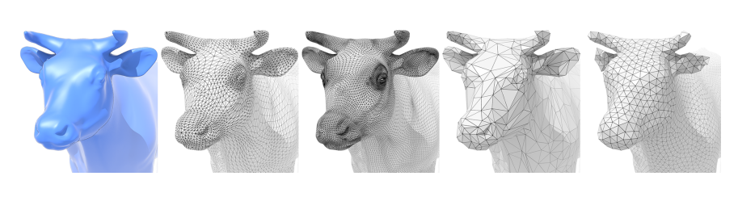
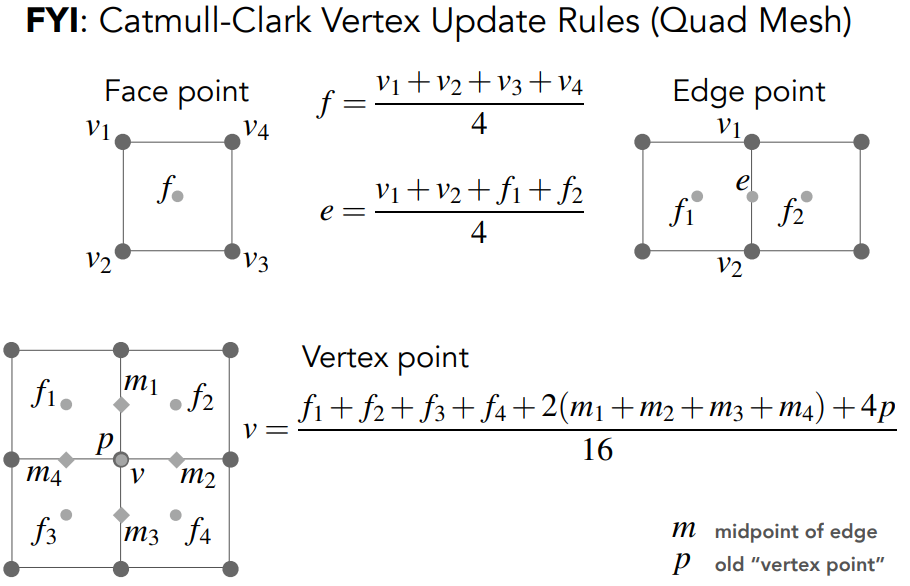
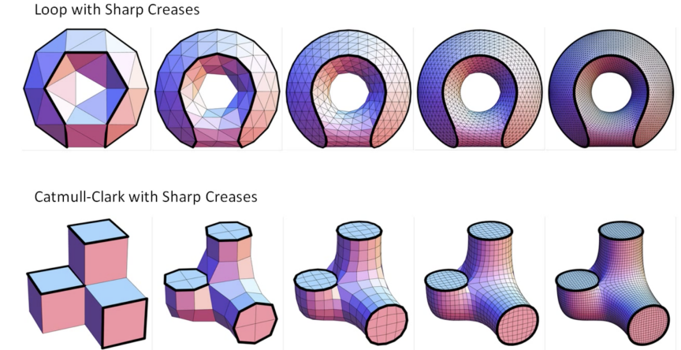

### 网格操作

- 网格细分subdivision
- 网格简化simplification：细分的逆过程
- 网格正规化

## mesh subdivision

使用更多的mesh。

#### Loop subdivision

**只适用于三角形网格**

- 在一个三角形内部细分更多的小网格
- 区分新老顶点，分别更新（调整位置）,使得更光滑；
  - 新顶点：$\frac{3}{8}(A+B)+\frac{1}{8}(C+D)$
  - 旧顶点：$(1-nu)*x_0+\sum ux_{neighbor}$；n越小说明原位置$x_0$越重要

#### Catmull-Clark subdivision

适用于各种（包括混合）网格

奇异点(Extraordinary vertex)： degree != 4；度表示一个顶点连接的边（点）。

- 取每个多边形的中点，与该多边形上每条边上的中点连接
  - 非四边形的中点产生新奇异点、之后奇异点数量不会增加
  - 一次细分后，多边形全部变为四边形了。
- 更新点：新老顶点分别更新。

**收敛性**

## mesh simplification

对于远处的物体，可以使用更少的网格。

#### edge collapse

二次误差度量：新点到其他边所在直线的平方和距离最小

数据结构：优先队列

迭代寻找

