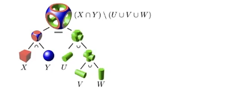
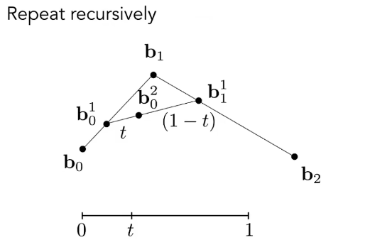
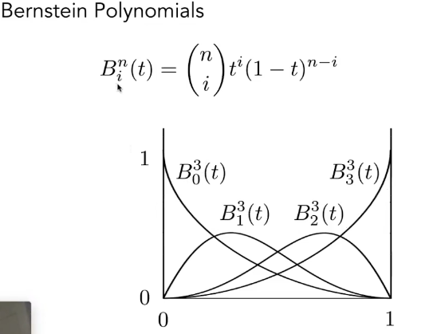
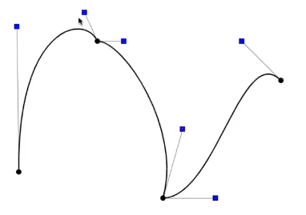
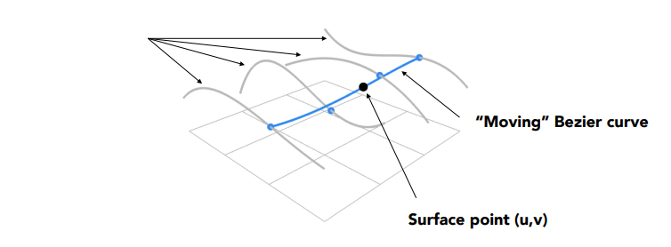

### 隐式几何

- 点满足的关系，如$x^2+y^2+z^2=1$
  - 容易判断点与物体的关系，如内外关系
  - 不方便描述复杂物体
- algebraic surface
- CSG(constructive solid geometry)，基本几何体的布尔运算（交叉并集）
- distance function：描述点到表面的最近距离（可有正负号），圆滑过渡。$f(x)=0$即为表面位置。
- level set； 
- 分形：自相似性

### 显式几何

- 直接坐标
- parameter mapping；$f(u,v)\rightarrow(x,y,z)$

- 容易显示形状
- 不容易判断内外关系。

#### 点云

表面由一堆点组成；

容易表示任何几何形状

#### 多边形面 polygon mesh

- 连接关系
- .obj文件记录点法线面关系

#### curve

**贝塞尔曲线**：用一系列控制点（表示起终点和起终方向）表明曲线。

**算法**(Casteljau Algorithm)：画线的算法转为找到其中点(t)的位置。

Bernstein Polynomials：
$$
B_i^n(t) =\\
b^n(t) = \sum_{j=0}^n b_j B_j^n(t)
$$

**性质**：

- Cubic case：$b'(0)=3(b_1-b_0); b'(1)=3(b_3-b_2)$
- 放射变换（一个线性变换加平移）：
- 凸包性质：曲线位于控制点形成的凸包内

#### 分段贝塞尔曲线

取代高阶贝塞尔曲线

确保光滑：导数连续

#### 样条

### 曲面

#### 贝塞尔曲面

