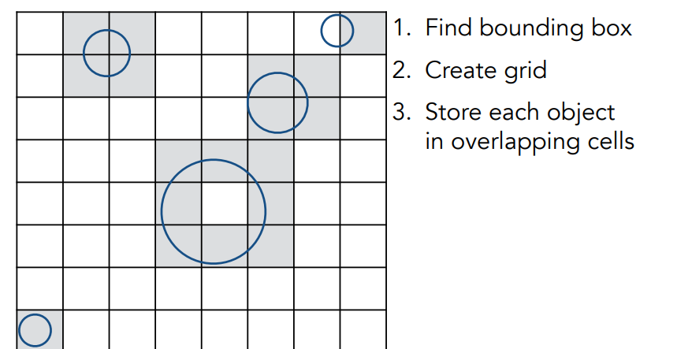
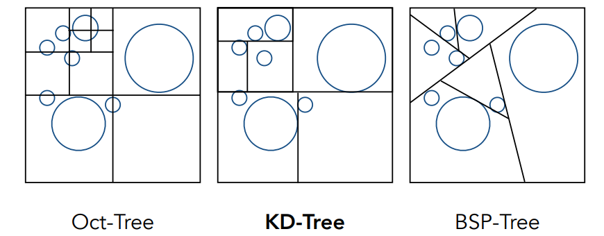
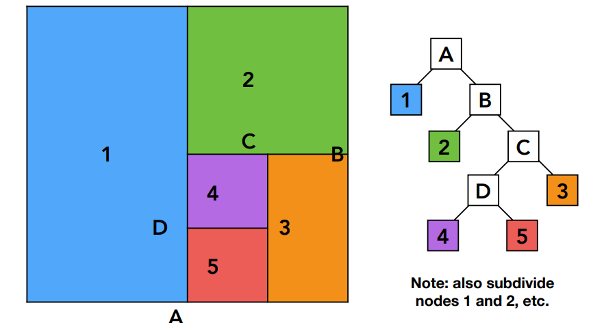
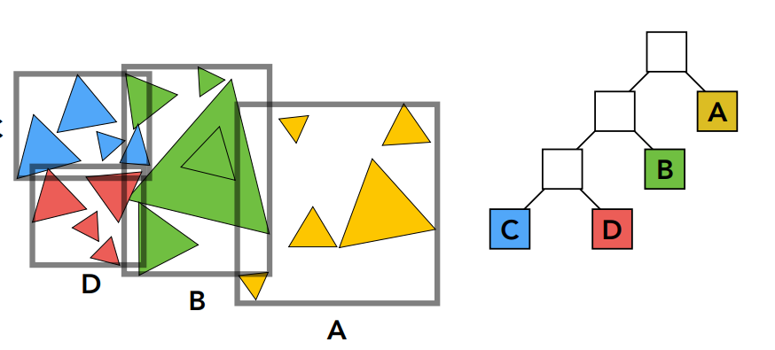

## 加速

### 网格化Uniform Spatial Partitions (Grids)

光线追踪前的预处理。

找到有物体的网格，判断是否与物体相交

网格太稀则覆盖面积太大；太密则寻找光线相交网格太多次；

- 平衡网格数与物体数

#### 效果

取决于场景：比如空旷运动场一个小茶壶，这样效果就不太好。

### Spatial Partitions

#### 建立KD-Tree

#### 寻找交点

1. 寻找包围核是否有交点
2. 寻找与两个子结点是否有交点
3. 不断往下寻找交点

难点：判断物体是否在子区间内很难；物体与多个子区间有交集。

### 物体划分Bounding Volume Hierarchy (BVH)

实际应用的主流

1. 物体分为左右两部分，重新得到两个新的包围核

2. 继续划分两部分，再求包围核

KD-Tree先分空间；这里先分物体再求包围核。

**确保了一个物体只出现在一个包围核里**。

#### 如何划分

- 选择最长轴划分
- 找median object

### 对比两个划分

