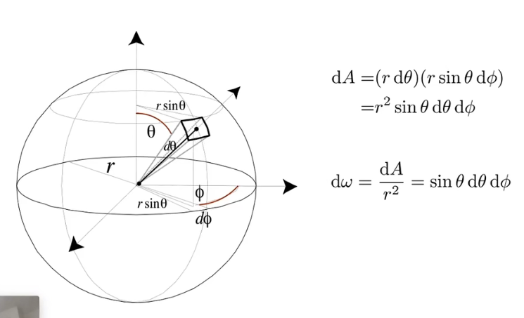
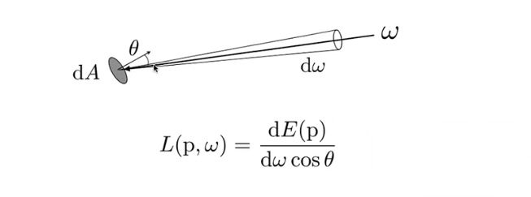
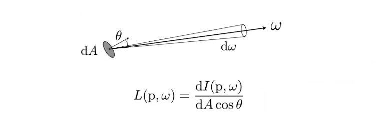
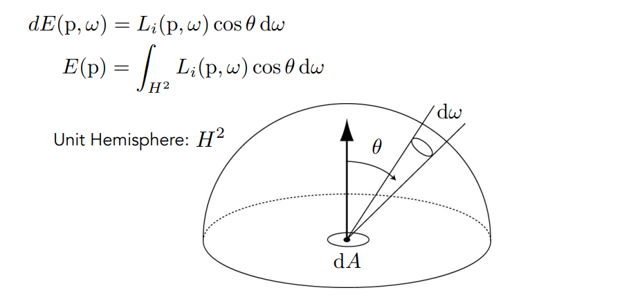

### 动机

之前的模型过度简化，不太符合现实

### 内涵

- radiant flux
- intensity
- irradiance
- radiance

### radiant energy and flux (power)

energy: Q，单位焦耳

flux：单位时间的能量（功率），$\Phi=\frac{d Q}{dt}$；单位瓦特，或者lumen

### Radiant intensity

power per unit solid angle

$$ I(\omega)=\frac{d \Phi}{d\omega}$$

单位candela。

定义立体角$\omega$：弧度在三维空间的延伸；$\Omega=\frac{A}{r^2}$，A为球面立体角对应的一段面积；一个球立体角$4\pi$。

弧度：$\theta = \frac{l}{r}$；$2\pi$为周期；

 $$I=\frac{\Phi}{4\pi}$$

$$
dA=(rd\theta)(rsin\theta d\phi) = r^2sin\theta d\phi\\
d\omega = \frac{dA}{r^2}=sin\theta d\theta d\phi
$$

注意sinθ，所以在赤道变化更大。

#### Irradiance

power per unit area
$$
E(x) = \frac{d\Phi(c)}{dA}
$$
单位$$[\frac{W}{m^2}][\frac{lm}{m^2}=lux]$$

注意：需要是**垂直面积**

### Radiance

用于**描述光线**辐射出去、反射、转移或接收；

power per unit solid angle, per projected unit area
$$
L(p,\omega)=\frac{d^2\Phi(p,\omega)}{d\omega dA cos\theta}
$$
**总结**：

- Irradiance: power per projected unit area
- Intensity: power per solid angle  

So  

- Radiance: Irradiance per solid angle 

- Radiance: Intensity per projected unit area

#### 入射 radiance

某个方向进来的能量被$dA$收到多少，具有方向性

#### 出射 radiance

$dA$往各个方向发射的能量

#### 对比irradiance和radiance

irradiance：$dA$收到的能量

radiance：$dA$中某个方向收到的能量。

