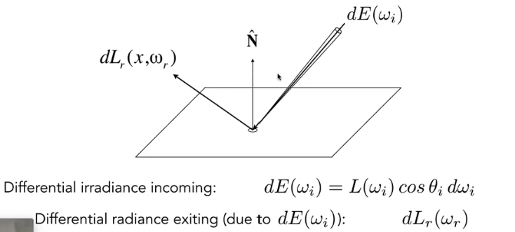
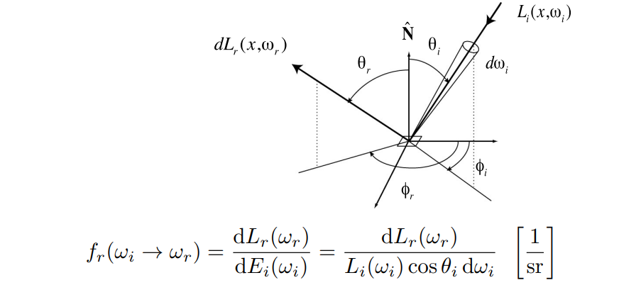
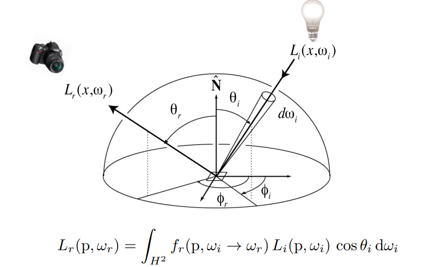
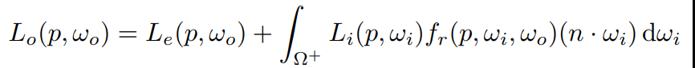
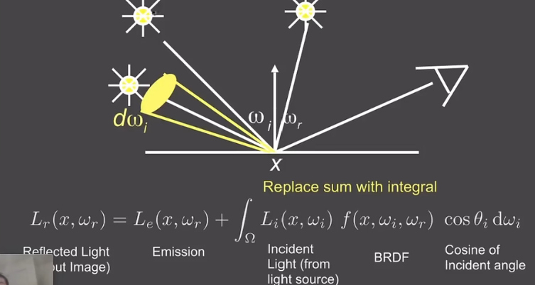
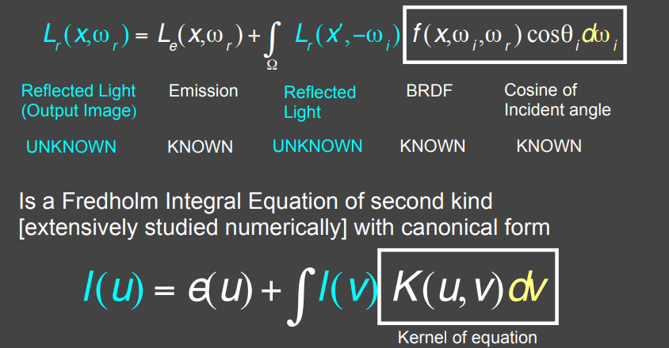
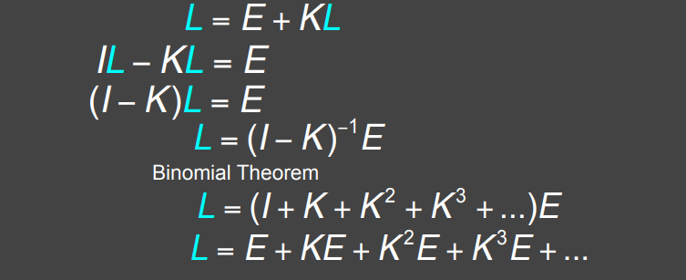
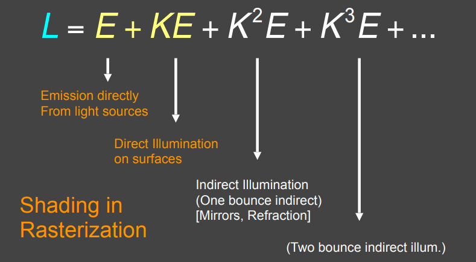

## Bidirectional Reflectance  Distribution Function  (BRDF)

双向反射分布函数。

### 单点的反射

可以理解为：某个点先接收能量，再发射出去。

#### 反射能量的分散；

BRDF代表光线如何从某个入射能能量分散到不同方向

### 反射方程

积分所有如何方向得到某个方向出射光的radiance。

### 递归方程

除了光源，还有其他物体反射来的光回到达$dA$。即$L_i$来源复杂（直射光、反射光、环境光）。

但是要注意：直射光占据了大部分。

### 渲染方程

在反射方程的基础上考虑物体自身会发光$L_e$；得到rendering equation：

$\Omega^+$表示上半球，因为下半球不可能有光线反射到。

#### 求解积分方程

1. 直射光源：

2. 把反射点也当作光源

$$
L= E+KL
$$

#### 射线追踪

