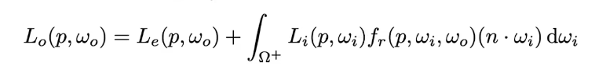
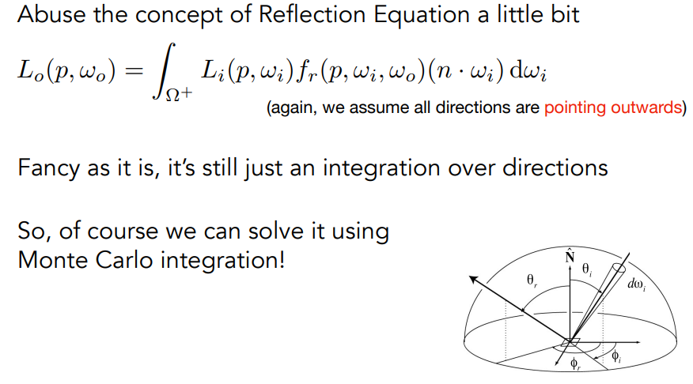
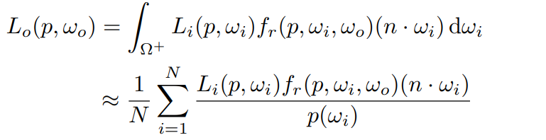
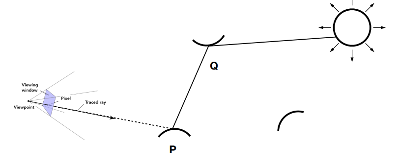
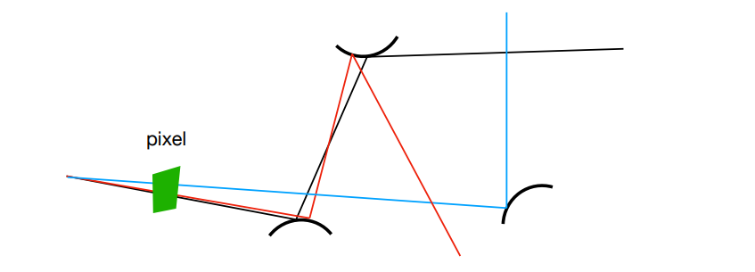
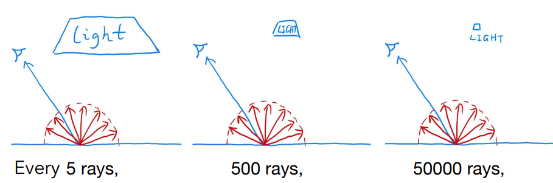
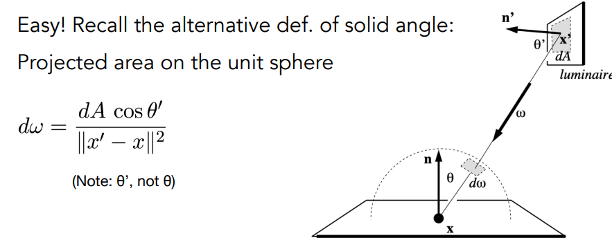
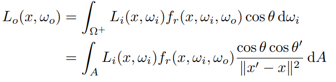

#### 蒙特卡洛积分

基本项（x均匀采样）
$$
\int_a^bf(x)dx = \frac{b-a}{N}\sum_{i=1}^Nf(x_i)
$$

推广项（x以$p(x)$概率采样）

$$
\int_a^bf(x)dx = \frac{1}{N}\sum_{i=1}^N\frac{f(X_i)}{p(X_i)};\quad X_i \backsim p(x)
$$

## 路径追踪path tracing

Whitted-Style 射线追踪

- 停止于漫反射
- 光滑表面，计算反射和折射

问题：

- 过于绝对，无法考虑两种折衷的情况。

- 停止于漫反射不对

### 渲染方程求解

### 蒙特卡洛求解渲染方程

只想求某一个像素点的直接光照，忽略发光项；球面积分

使用蒙特卡洛积分。

在这里：$$f(x)=L_i(p,\omega_i)f_r(p,\omega_i,\omega_o)(n\cdot \omega_i)$$

**均匀采样**：$$p(\omega_i)=\frac{1}{2\pi}$$

这里$L_i$只有到达光源才有值

### 考虑反射

反射的光照就等于反射点的直接光照，所以使用递归算法。

### 算法的问题

#### 1. 光线的数量会爆炸

递归导致数量倍增：$n_{ray}=N^{bounces}$

但是如果$N=1$（蒙特卡洛采样点数）（这也是为什么被称为路径追踪），则不会爆炸。一个点导致噪声太大。

但是可以使用多个路径。

#### 2. 递归的终止条件

如果直接设定截至的反弹次数，不符合物理规律。

Russian Roulette（RR，俄罗斯轮盘赌）：

- 给定一个概率$P$，令返回值为$L_o/P$
- 概率$(1-P)$，返回0。
- $E=P*(L_o/P)+(1-P)*0=L_o$

每次反射都可能会停止

#### 3. 效率

如果路径少（单个像素点路径少，ssp），则噪声大。

效率不高（路径少还可能找不到点光源）

#### 改进采样方案

考虑在光源上采样。

原始渲染方程在像素点的半球上积分；转移到光源上积分

重写渲染方程

两部分

- 直接来自光源：光源采样的渲染方程
- 来自其他反弹：原方法

还需要判断光源是否可以直接作用于像素点。

（所以尽量用面积光源代替点光源）

### 现代光线追踪

-  (Unidirectional & bidirectional) path tracing  
- Photon mapping  
- Metropolis light transport  -
- VCM / UPBP…

### 前沿

- 结合光源采样和空间（立体角）采样
- 为什么radiance是所有路径radiance的平均（无需加权）
- radiance和color关系。