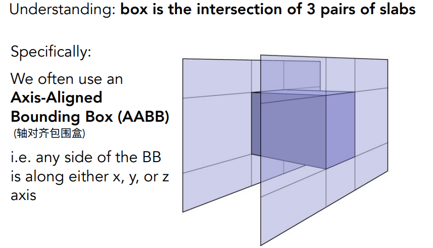

### 光栅化的问题

对于**全局效果**的表现不好，比如：软阴影、非镜面反射（glossy reflection）、间接光照（多次反射）。

光栅化优点是很快。通常是实时

### 光线追踪

准确但速度较慢，一般离线渲染；符合物理规律

- 光是直线传播（不考虑波动性）

- 光线不碰撞
- 光路是可逆的

求交点：

#### Whitted-Style 多次光线追踪

先用射线追踪到相机到物体的点，再计算该点是否和光源符合条件（）

### 射线方程

$$
\mathbf{r}(t)=\mathbf{o}+t\mathbf{d};\quad 0\le t\le+\infty
$$

o是原点（光源），d为方向矢量；

#### 举例

求光线和球（$(\mathbf{p}-\mathbf{c})^2-R^2=0$）的交点；

交点：即在射线上，又在球上
$$
(\mathbf{o}+t\mathbf{d}-\mathbf{c})^2 - R^2=0
$$
根据二次函数求根公式可以得到t的值。

#### 隐式表面

推广到一般表面：

implicit surface: $$\mathbf{p}:\quad f(\mathbf{p})=0$$

带入射线方程：$$f(\mathbf{o}+t\mathbf{d})=0$$

#### 显式表面

**光线和三角形相交**：

- 是否和平面相交(点在平面上)
- 点是否在三角形内

定义平面：给平面一个点和法线；$\mathbf{p}:(\mathbf{p}-\mathbf{p'})\cdot\mathbf{N}=0$

代入射线方程：$(\mathbf{o}+t\mathbf{d}-\mathbf{p'})\cdot\mathbf{N}=0$

**Moller Trumbore算法**：

更快的算法：使用重心坐标系

**如何判断相交的三角形**

- 用所有三角形与射线方程计算：非常慢

- 包围核（bounding volumes）：用个规则形体圈定物体；首先确定光线是否穿过包围核。

  - 定义长方体（包围核）：用3个对面（AABB）定义

    

  - 判断光和包围核是否相交。下面以二维为例。二维由2个对线构成；管线闯过对线1的点为左图，对线2为中图，右图取两个交线的公共部分。

    

  - 对于3D，光线进入所有对面称为进入，离开任意一个面称为离开。求出光线进出3个对面的数间，然后求取。用数学表示：$t_{enter}=max\{t_{min}\};t_{exit}=min\{t_{max}\}$
  - 3D的交点：$t_{enter}<t_{exit}$
  - 因为光线是射线而不是直线，需要检查数间t大于0 。
    - $t_{exit}<0$，没有进入
    - $t_{exit}\ge 0,t_{enter}<0$，光线起点位于包围核内部，
    - 总结：$t_{enter}<t_{exit}\, \text{and}\, t_{exit}>0$ ，则肯定有交点。

  - 光线与对面求交点：

