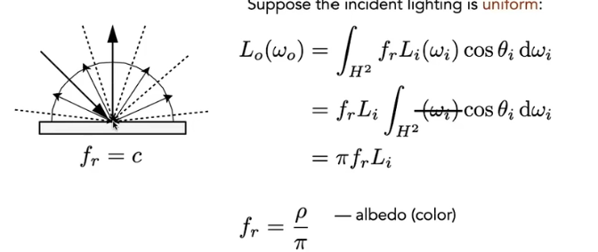
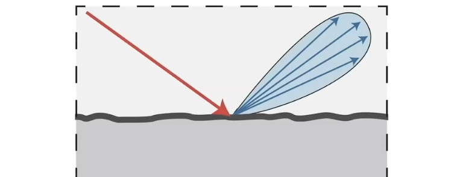
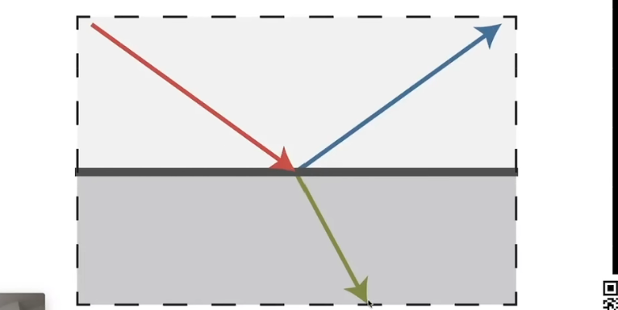
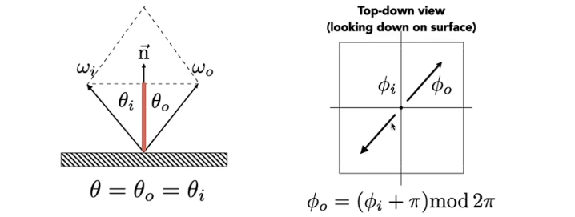
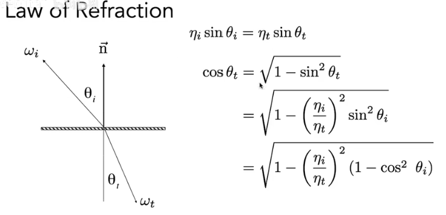
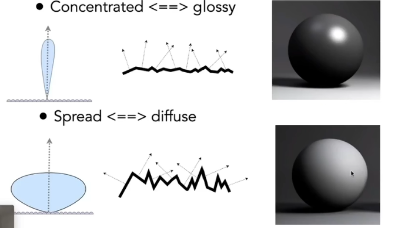

## 反射

#### material==BRDF

### 漫反射

假定不发光也不吸收

此时$L_o=L_i$；完全不吸收时，$f_r=\frac{1}{\pi}$。

有吸收时，定义反射率$\rho$处于0~1之间。

### Glossy material(BRDF)

金属光泽。

### ideal reflection/refraction(BSDF*)

玻璃材质

### perfect specular reflection

镜面反射

$$
w_o+w_i=2cos\theta \vec{n}=2(w_i\cdot\vec{n})vec{n}\\
w_o=-w_i+2(w_i\cdot\vec{n})vec{n}
$$
BRDF为delta冲激函数

## 折射

### Fresnel Term

描述光在两种不同折射率的介质中传播时的反射和折射。

反射和折射与**入射角度**有关。

### Microfacet Theory

微表面

- macroscale：flat
- microscale：bumpy

#### microfacet BRDF

法线的分布。表现表面粗糙程度

### 各向异性材质

### BRDF的特质

