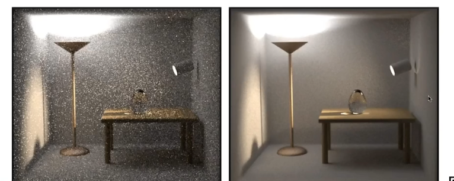
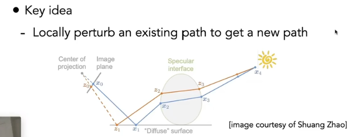
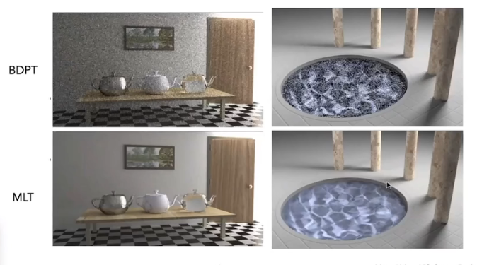

### Bidirectional Path Tracing（BDPT）

如果第一个bound是漫反射，路径追踪容易出现问题

难以实现

### Metropolis Light Transport（MLT）

马尔科夫链采样。

优势：生成样本的分布与被积函数形状一致（得到无偏蒙特卡洛积分）

适用于复杂和困难的路径

劣势：

- 难以估计收敛速度
- 局部操作，不保证每个像素收敛
- 图像脏（像素收敛不同）

### Photon Mapping

适于caustics（透镜聚焦？）

