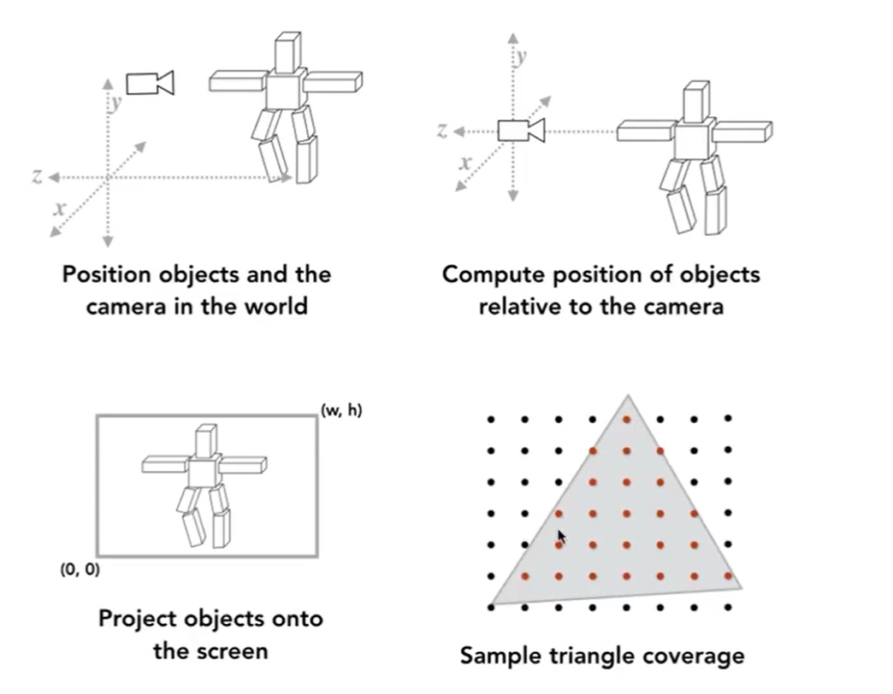
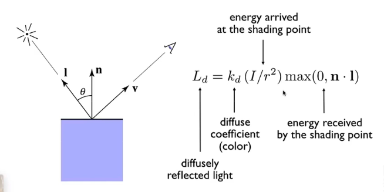
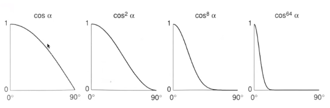
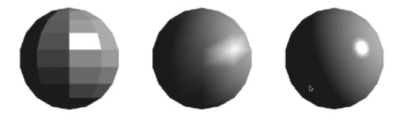
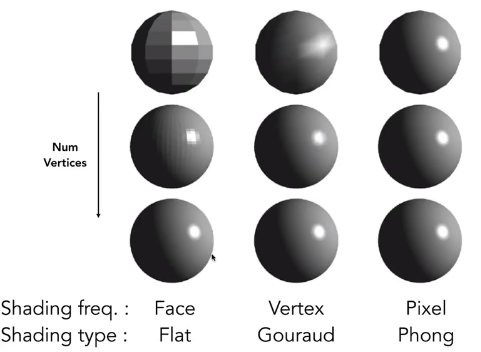

### 着色流程

### 漫反射

与视角v无关。

### 高光

近似镜面反射，

p参数使得高光尽量集中于几个角度里；

### 环境光

假设：

- 任何一个点收到的环境光强度一致
- 环境光系数也一样；

即为常数；

### 着色频率

左（flat shading）：对一个面计算着色

中（Gouraud shading）：对每一个顶点着色计算，在用插值方法在三角形内（三个点构成的）。顶点的法线？看作球上的点。实际计算：相邻面法线的平均

右（Phone shading）：像素点着色计算

### 纹理

