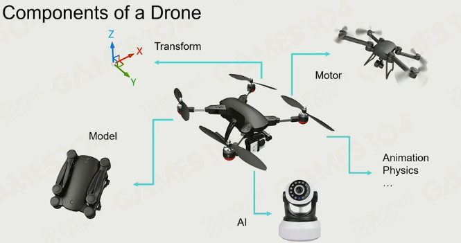
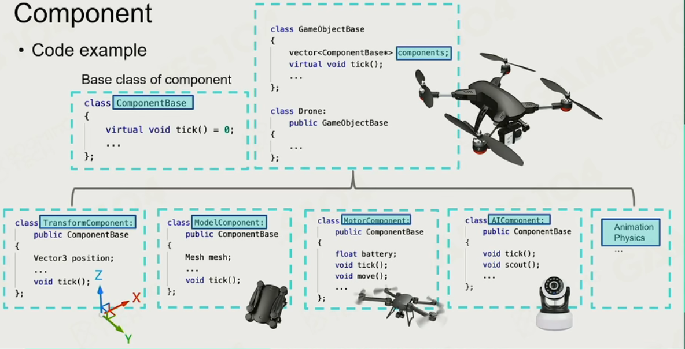
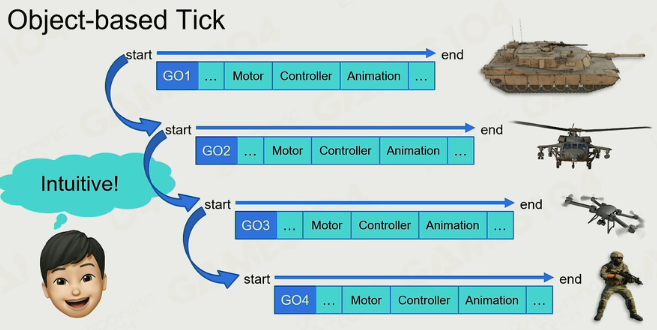
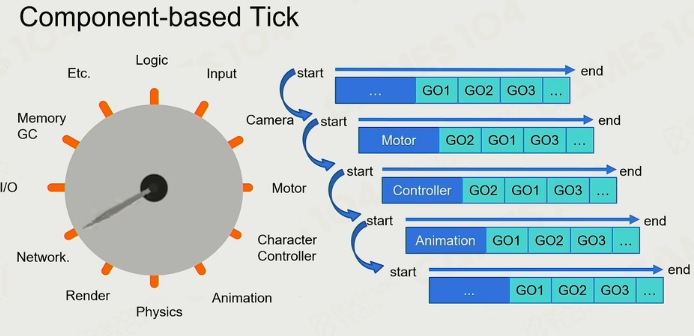

## 构建游戏

#### dynamic game object

#### static game object

#### environments

环境、地形、植被、天气

#### 其他游戏对象

### 属性与行为

属性：类的成员变量

行为：成员函数

类的继承：广泛应用于游戏。

问题：继承衍生关系并不是非常清晰。

#### 组件化

游戏由一个个game object（GO）构成

每一个GO有一个个component组成

#### 问题：

- 对于简单物体效率不太高；通过批处理提高总体效率
- 组件之间通信接口：高频通信影响效率。

## 游戏动作

统一对部件进行动作；即批处理（矢量化并行）

### 交互

#### Hardcode

炮击：生成新的GO（炮弹）、碰撞检测（击中）、碰撞处理（炸效果）

#### Events

可扩展的消息机制

解耦合：向GO广播、GO做出处理

#### Scene management（场景管理）

判断是否处于动作范围：

- 基于空间划分：疏密不同
- Quadtree：四叉树/八叉树
- BVH：包围核
- ……

#### 通信机制

确保时序

