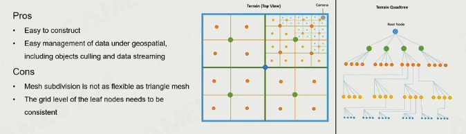
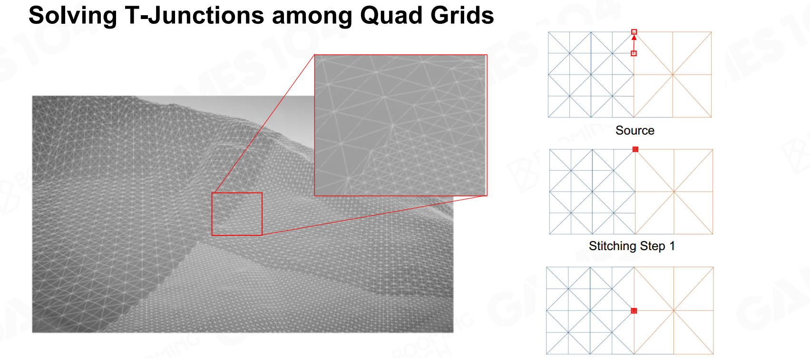
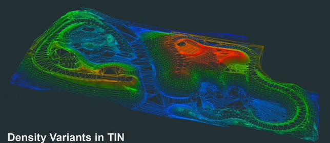
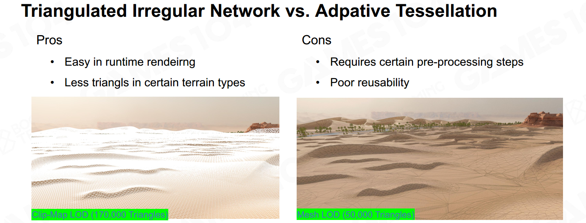
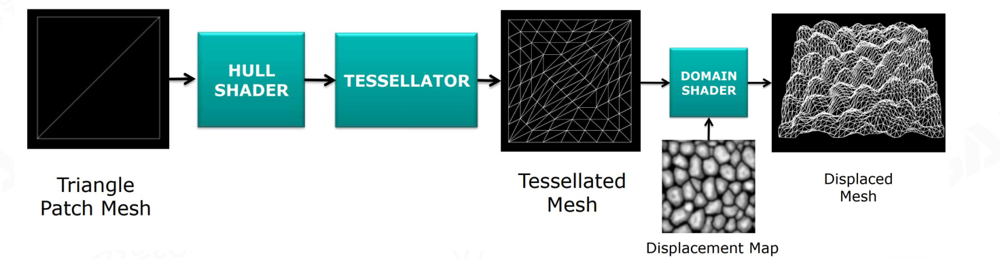

## 地形几何

### Adaptive mesh

自适应网格：随着视角深入，物体细节增加 

#### Triangle-Based Subdivision

用的不多

#### QuadTree-Based Subdivision

暗含资源管理

**解决T-junctions：**

利用吸附性把点吸附到邻近点（退化三角形）；

#### Triangulated irregular network（TIN）

简化顶点（顶点汇聚到山脊）

#### 对比

#### Hardware Tessellation

#### mesh shader pipeline

directX12支持。更简单只管

#### real-time deformable terrain

 

## 地形材质

#### texture array

