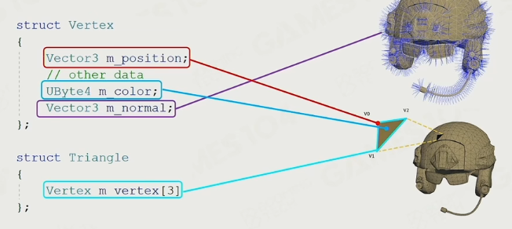
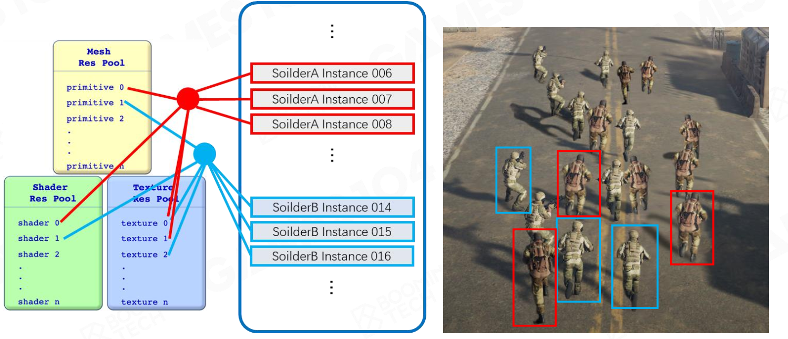
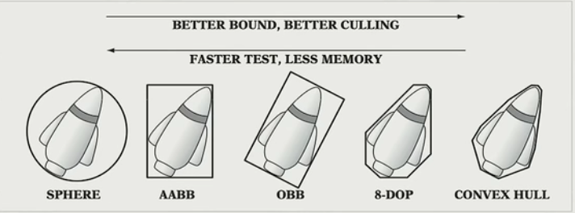
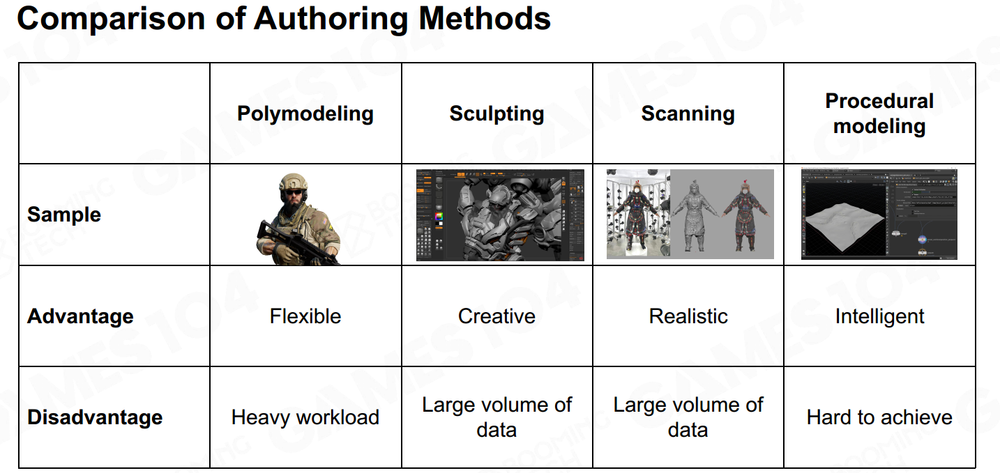

realtime（30FPS）

interactive（10FPS）

### Challenge

- 物体对象和类型非常多
- 联合CPU和GPU
- 帧率（>30FPS）和分辨率（1080P）
- CPU和内存带宽有限

### Rendering的关键

- projection transform
- rasterization
- shading
- texture sampling

### GPU

- SIMD：单指令多数据
- SIMT：单指令多线程

cache限制

### blocks of renderable

#### mesh primitive

#### vertex and index buffer

类似于有限元网格的存储

为什么需要**存储**法向？有折线时其法向再两边不同。

#### materials

光照材质属性

#### texture

纹理一定程度决定了材料

#### shaders（着色器）

### 渲染过程

按类别分成各个库渲染；

#### instance

从一个类别（定义）得到的一个实例（可以有些许变化）

排序：按相同材质分类排序；

#### batch rendering

相同的东西一次同时绘制

####  visibility culling

计算包围核是否在视角里。 

BVH优势：更新开销小

### texture compression

#### block compression

取一小块；找到最亮和最暗的像素，其中的就插值

### modeling（建模）

- polymodeling
- sculpting（雕刻）
- scanning（扫描）：花费高
- procedural（自动生成）

