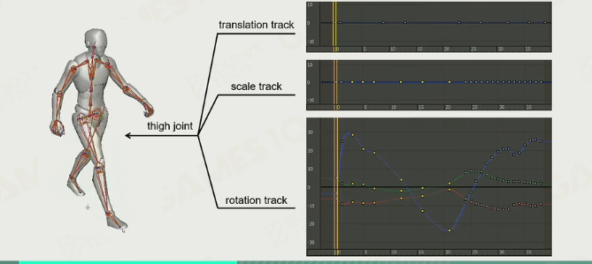
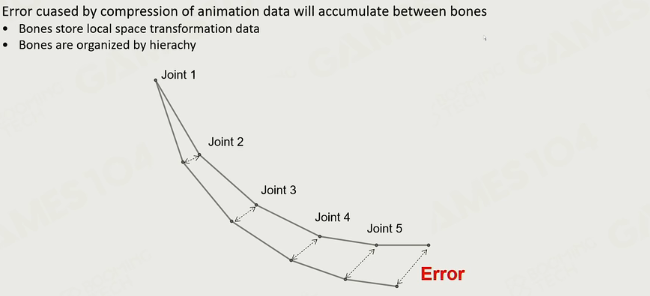

### 动画压缩

变化少

#### 1.简单压缩

自由度压缩

无变化的只存储标量

#### 2. keyframe extraction

只保留关键帧，然后插值

#### Catmull-Rom Spline

光滑插值

#### 3. float quantization

从32bit压缩到16bit 无符号整数

**quaternion quantization**：除去最大值，剩下三个值位于$[-\frac{1}{\sqrt{2}},\frac{1}{\sqrt{2}}]$。

#### 误差传播

### 动画制作

