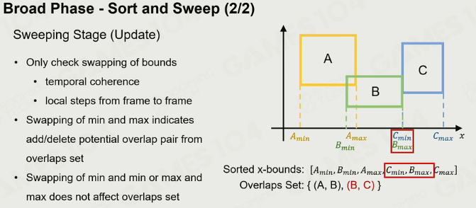
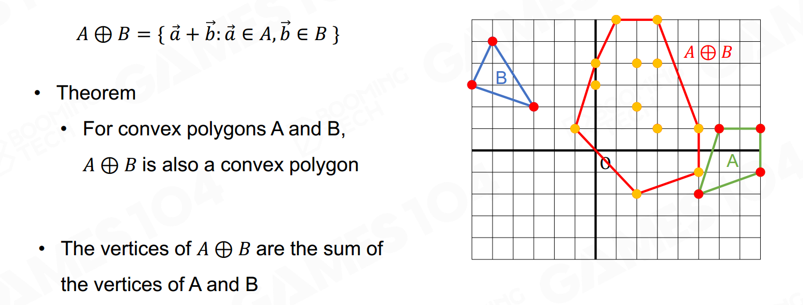
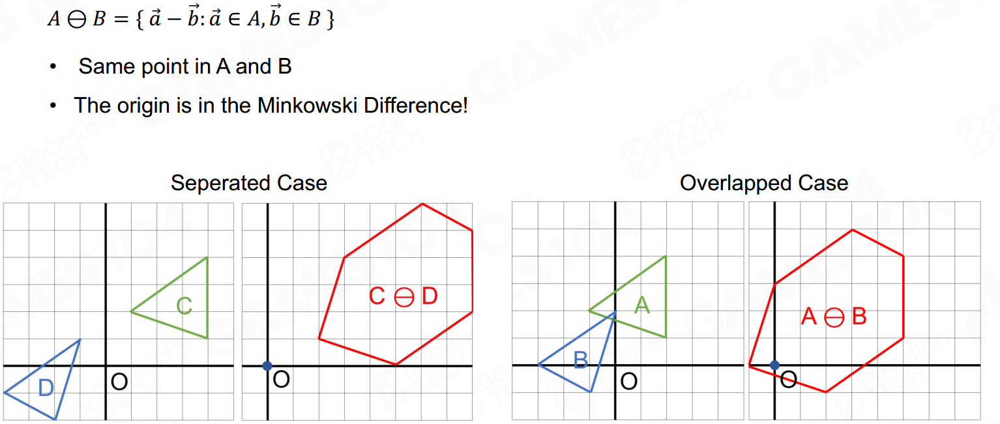

### 挑战

- Kinematic Actors

### Actor

- static actor
- dynamic actor
- trigger
- kinematic actor

#### 形状

规则的（有解析表达的），便于求交并集；

- 球：
- 胶囊：比如人
- Boxes
- convex meshes：石头
- triangle meshes：建筑
- height field：地形

复杂度逐渐增加

质量均匀

质心高低

### Force

- 重力
- 拉力
- 摩檫力
- 冲力

### 碰撞检测

#### BVH

#### Broad phase

减少计算量。

#### Narrow Phase

规则形体简单。

困难的是凸包。

**Minkowski sum：**

**Minkowski difference**

**GJK算法**：快速检测（对比Minkowski）、逼近迭代

**separating axis theorem（SAT）**：

每条边作为分离轴，检测是否相交

### collision resolution

- penalty force：加反向力
- solving constraint：拉格朗日力学
- 

### 效率、准确性、确定性

分组，让一些对象sleeping；

continuous collision detection

#### 确定性

难以保证

