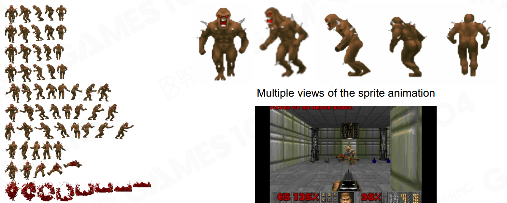
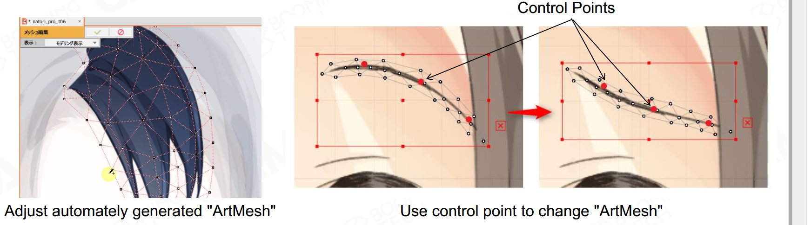
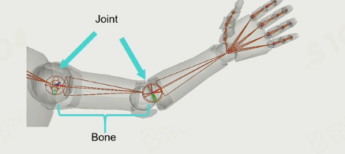
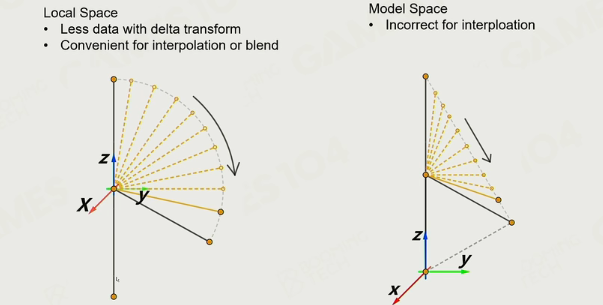

### 动画在游戏中的挑战

- 交互
- 实时性
- 数据大、存储和内存处理

## 2D动画

### Sprite-like animation  

把每一个动作存为一帧，根据视角显示相关帧，得到伪3D

### Live2D

把对象分为多个图元，用很多网格控制

## 3D动画

#### DoF（自由度）

刚体有6个自由度：平移3个、旋转3个

#### per-vertex animation

用多个顶点控制物体、提前计算并存储每个顶点的运动

#### Morph Target animation

顶点控制的变种；用于人脸。

#### 3D skinned animation

顶点与多个骨骼相关（不会导致不同部位穿插）

#### 2D skinned animation

#### 基于物理的动画

- Ragdoll
- 衣料和流体模拟
- Inverse Kinematics（IK）：给定结果，计算过程

#### creation

- 手绘模型
- 动作捕捉

### skinned animation

坐标系：

- 全局坐标
- 模型坐标
- 局部坐标：每个骨骼自己的坐标系

变化都发生在局部坐标系，再积分到模型坐标系，最后渲染到全局坐标系。

#### skeleton

根节点：人体位于尾椎骨，向上为上半身，向下为腿部

Joint和Bone：

自由度位于joint（刚体）

#### Bind

joint绑定（同时运动）

### Joint pose

插值需在局部坐标系

