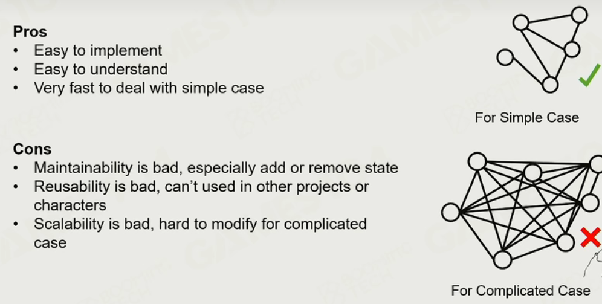

### 有限状态机

从一个状态转换到另一个状态

### 行为树

类似决策树

两种叶子节点

- 条件节点
- 动作节点

#### control node-sequence

#### selector

#### 并行节点

#### decorator

其他行为：比如等待、修改环境；对行为树小的优化

#### precondition

优化

#### blackboard

问题：没有长远目标