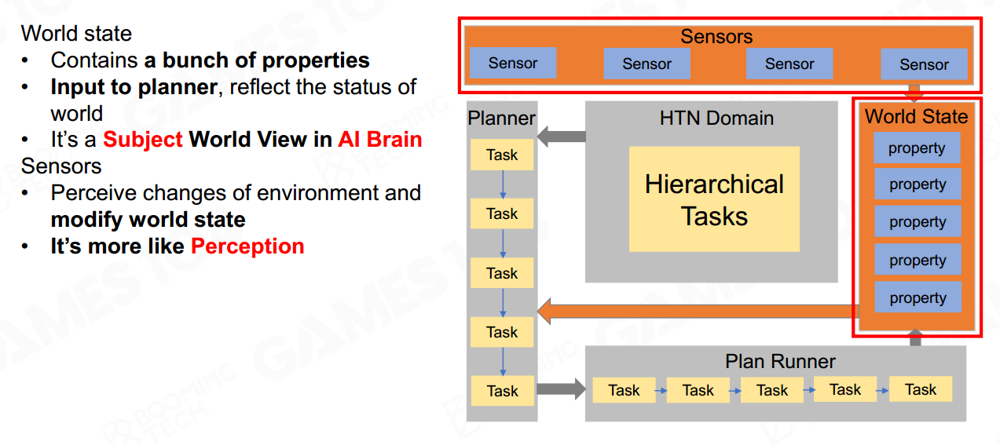
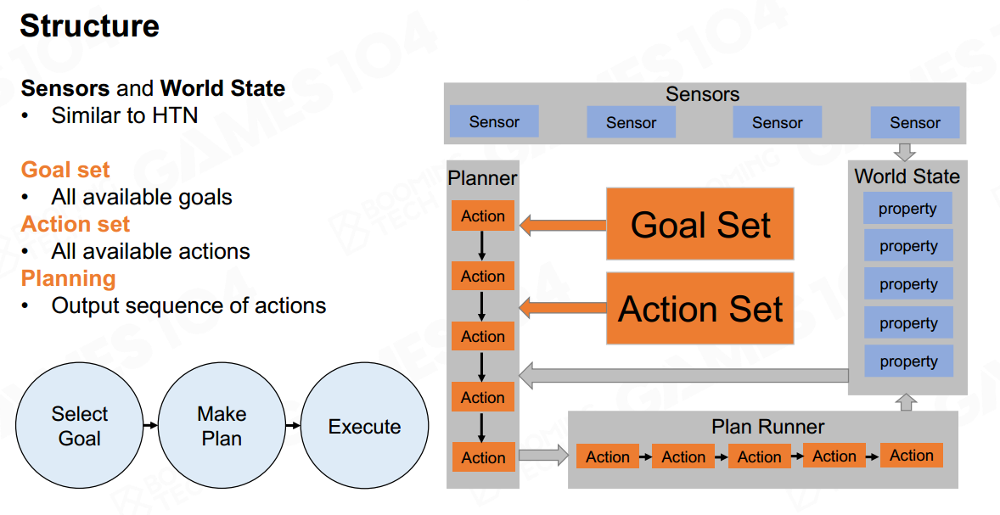
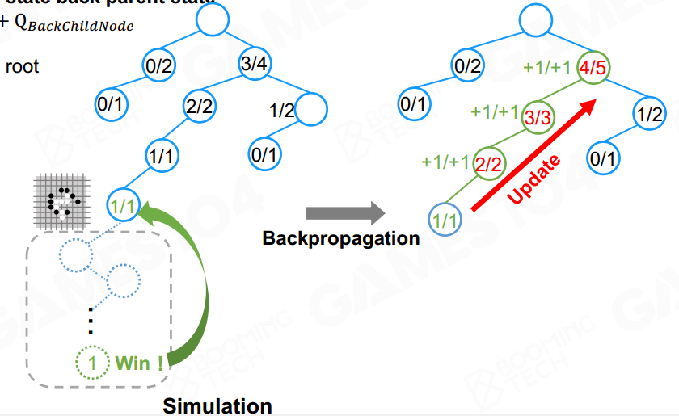
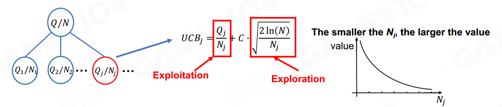
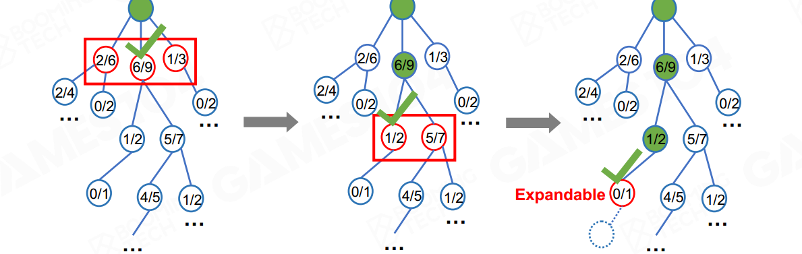
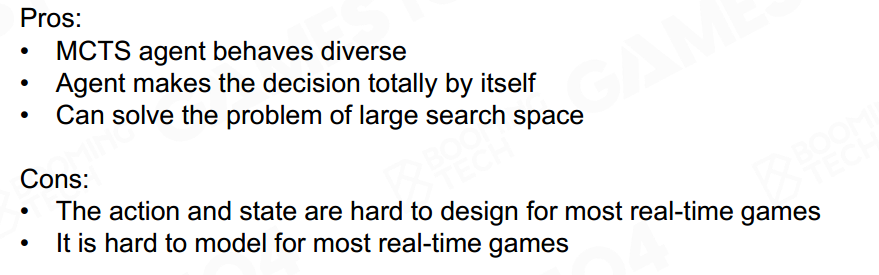

### hierarchical tasks network

设定任务，分解为子任务。

### Goal-Oriented Action planning

- 显式的目标；
- 

### Monte Carlo Tree Search

#### state space

树状结构，

#### simulation

Q： accumulation of simulation results

N：number of simulation

backpropagate：反向传导，更新所有的N/Q值

- 开发：Q/N（胜率）高、确定性高
- 探索：不确定，探索少的，N小

#### UCB理论

上置信空间，如何选择

C决定偏向开发还是探索。

#### expansion

找到未探索的节点，展开。

#### the end condition

- memory size
- computation time

#### choose best move

- Max child: Select the root child with the **highest Q-value**
- Robust child: Select the **most visited(highest N-value)** root child
- Max-Robust child: Select the root child with both the
  highest visit count and the highest reward. If none exist,
  then continue searching until an acceptable visit count is
  achieved
- Secure child: Select the child which maximises a lower
  confidence bound (LCB)  

$$
LCB_j=\frac{Q_j}{N_j}-C\cdot\sqrt{\frac{2ln(N)}{N_j}}
$$

