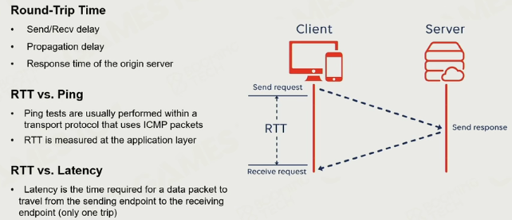

### 挑战

- 网络同步
- 网络延迟和不可靠（丢包、拥塞）
- 安全性：作弊、信息泄漏
- 多样性：跨平台、热更新（游戏中更新）
- 并发度：多玩家并发

### 网络连接

#### socket

#### TCP

- 稳定连接（三次握手）
- 有序
- 流量控制（解决拥塞）

#### UDP

- 连接不稳定
- no flow control
- no congestion control

通常混合使用：TCP稳定但是速度慢、UDP速度快但易丢包

#### reliable UDP

ARQ and FEC

处理丢包之类的问题

### 时钟同步

#### （round-trip time）RTT 

#### Ping

#### network time protocol（NTP）

多次校正求平均

#### stream-based time synchronization

多次NTP得到offset，排序，丢弃高于平均值50%的offset，再求平均。

#### remote procedure  call（RPC）

