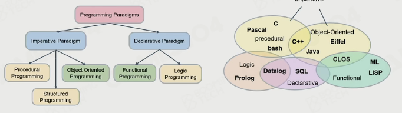
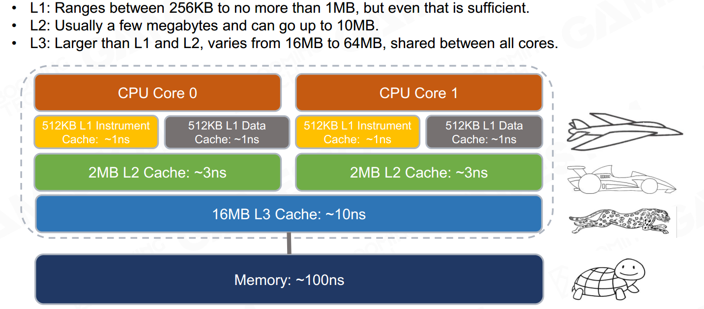
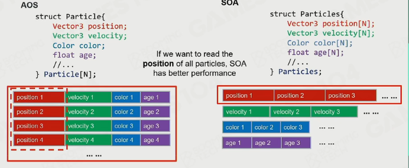

### 编程范式

#### 面向过程

函数

#### 面向对象（OOP）

对于交互动作的编写有歧义；

method scattering in inheritance  tree； 

基类可能非常臃肿

性能受限：每个object有自己的数据内存（碎片）、虚函数指针；

测试困难；

#### 面向数据（DOP）

核心：效率受限于内存

#### Cache

#### locality

#### cache line

一级一级读和写；按行和按列；

### 性能提升

#### 分支运算

出现分支时（if else）先对数据排序，因为CPU会对分支做预测。因此尽量让分支批处理。

#### array of structure vs. structure of array

### Entity component system（ECS）

