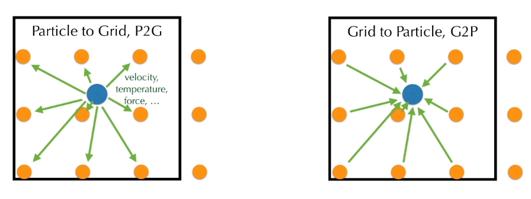

### Motivation

- 用拉格朗日粒子传输物质（位置、速度、形变）

- 用欧拉网格计算场（Chorin projection、Cauchy stress）

主要两个要点：

- advection
- projection（不可压缩）

#### 欧拉法

优势：

- 容易离散
- 寻找网格邻居很容易
- 预条件比较容易（均匀网格）

问题：

- advection：数值耗散

#### 拉格朗日法

优势：

- 移动
- 守恒（不容易耗散）

劣势：

- 离散困难（e.g. SPH）
- 数据结构复杂（寻找邻居，e.g. hash grid）

### 做法

以拉格朗日粒子为主，把中间结果赋予欧拉网格中

步骤：

- Particle to grid
- grid operation：pressure projection、boundary condition
- grid to particle
- particle operation

### particle-in-cell（PIC）

仅针对advection？

用核函数作为权重

#### B-spline kernels

#### 问题

信息丢失。

解决方案：

- particle保留更多信息：APIC、PolyPIC
- 仅用grid传递增量信息（而不是所有）：FLIP

#### 对比

### Material point method（MPM）

不仅仅是advection，而是整个模拟

### Moving Least Square MPM

优势：

- 速度更快，FLOPs更少
- 更容易实现