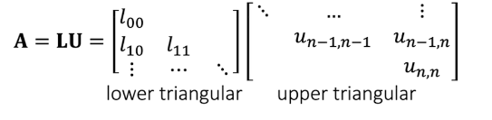
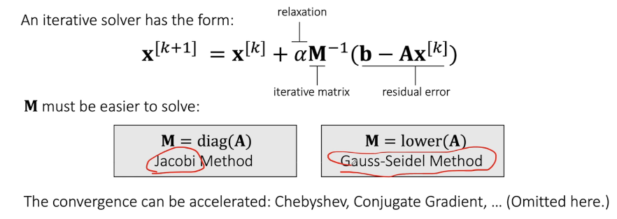
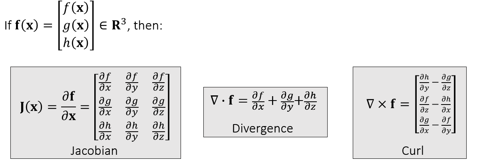
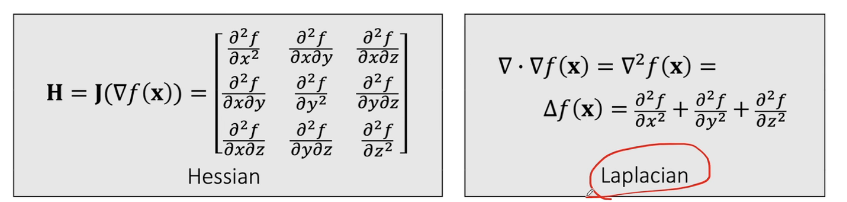
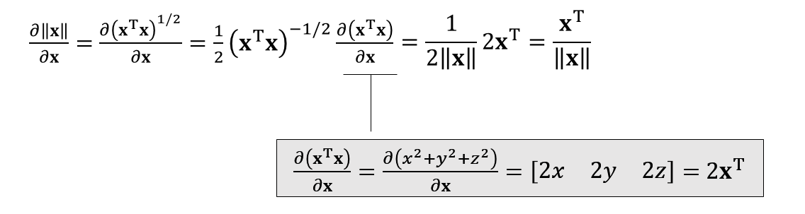
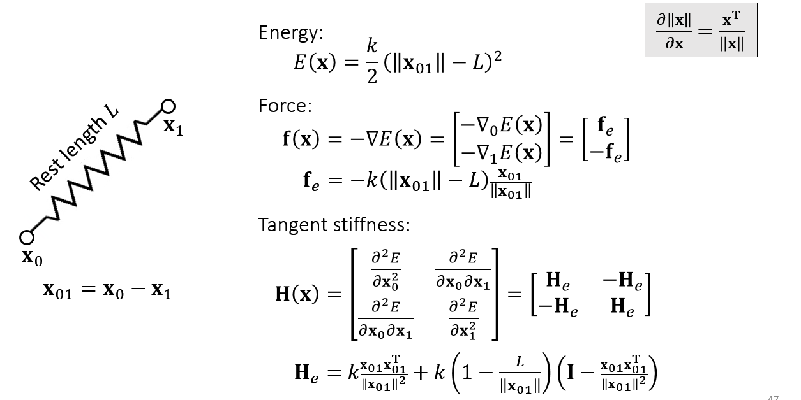

## 线性算子

$$
Ax=b
$$

#### 简单方法

直接求解$A^{-1}$。问题在于$A$ 往往是稀疏的，而其逆矩阵则不是，很浪费内存。

### 直接法

矩阵分解：LU分解，Cholesky分解（对称矩阵）

#### LU分解

如果要多次求解同一个A，只有b变化，可以用分解法。

**难以并行**：MKL Pardiso求解器部分并行。

### 迭代法

#### 定常迭代法

#### 非定常迭代法

优势：

- 相对更简单
- 速度更快，内存更小
- 可以并行

劣势：

- 收敛问题
- 无法得到真解

## 矢量微积分

$\bf{f(x)}$为矢量；

### 一阶导数

雅可比矩阵

散度：雅可比矩阵对角线元素之和

旋度：

### 二阶导数

海塞矩阵

拉普拉斯算子：海塞矩阵对角线元素之和

### 泰勒展开

与正定的关系，若为正定，则二阶项大于0；

#### 导数

### 简单弹簧系统

