### 点乘

$$
\vec{a}\cdot\vec{b}=\vec{a}^T\vec{b}
$$

点乘可以转变为转置的矩阵乘法。

#### 线

#### 面

判断面与点的位置关系；

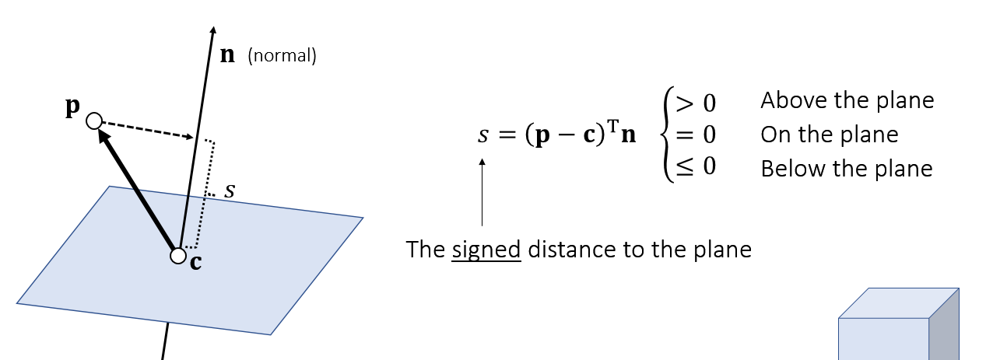

有符号的距离（可用于碰撞检测）

#### particle-sphere collision

发生碰撞：
$$
\left\| \vec{p}(t)-\vec{c}\right\|^2=r^2\\
(\vec{p}-\vec{c}+t\vec{v})\cdot(\vec{p}-\vec{c}+t\vec{v})=r^2\\
(\vec{v}\cdot\vec{v})t^2+2(\vec{p}-\vec{c})\cdot\vec{v}t+(\vec{p}-\vec{c})\cdot (\vec{p}-\vec{c})-r^2=0
$$
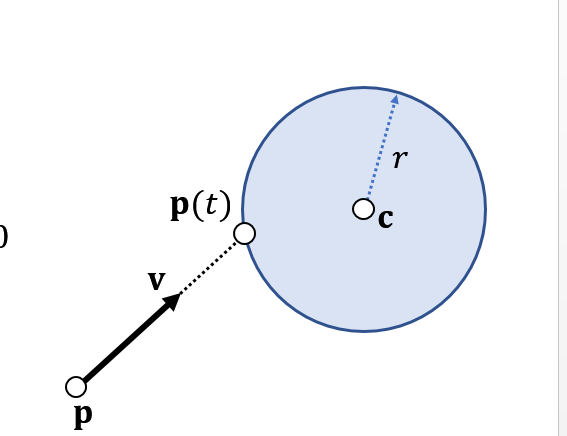

根据求解的根的数量判断：

- 没有根：无碰撞
- 一个根：粒子与平面相切，一次碰撞
- 两个根：>0且最小的值即为碰撞的解。

### 叉乘

#### 三角形面积与法向

计算法向：用叉乘

计算面积：用叉乘，

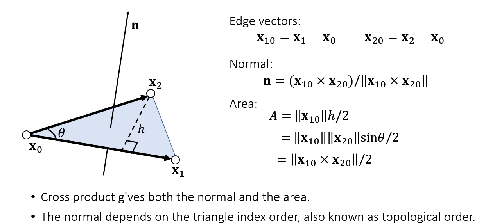

如何判断三个点是否在一条线上？

#### 判断点在里面还是外面

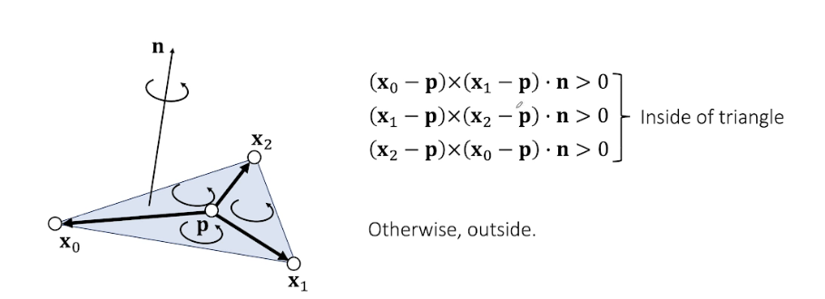

#### 重心坐标系

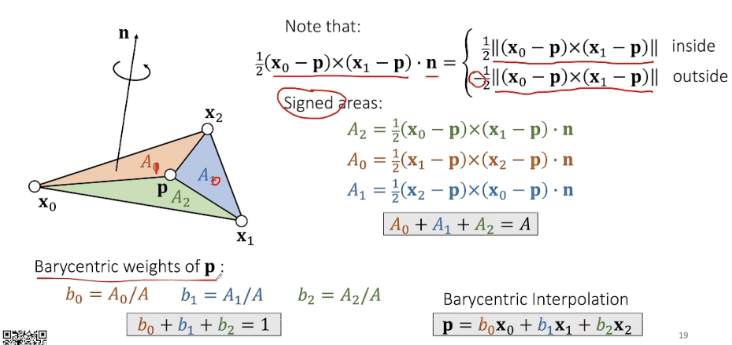

注意：p可以在外面，此时A0，A1和A2可能为负

#### Tetrahedral Volume

四面体；计算体积：

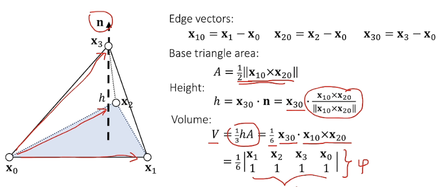

四面体的重心坐标系

#### 线是否穿过三角形

利用体积公式，找到体积为0的点，再判断点是否在三角形里。

### 矩阵

A不是对称矩阵，如何变为对称？
$$
(A^TA)^T=A^TA
$$
或者
$$
(A^T+A)^T = A^T+A
$$

$$
AA^{-1}=A^{-1}A=I
$$

#### 正交矩阵

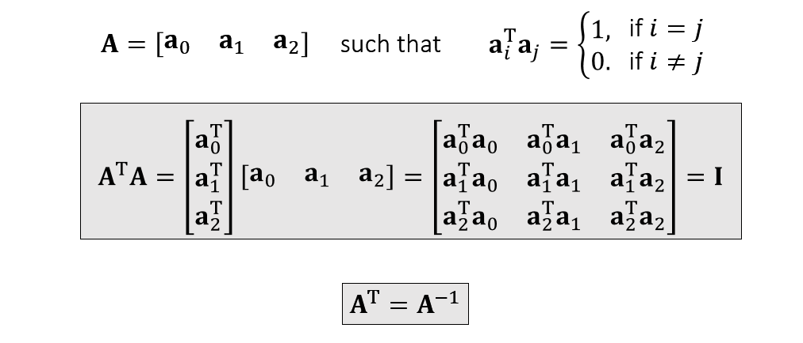

#### 矩阵旋转

可以用正交矩阵描述；

A为旋转矩阵（左乘），但A也是坐标系（即正交矩阵）

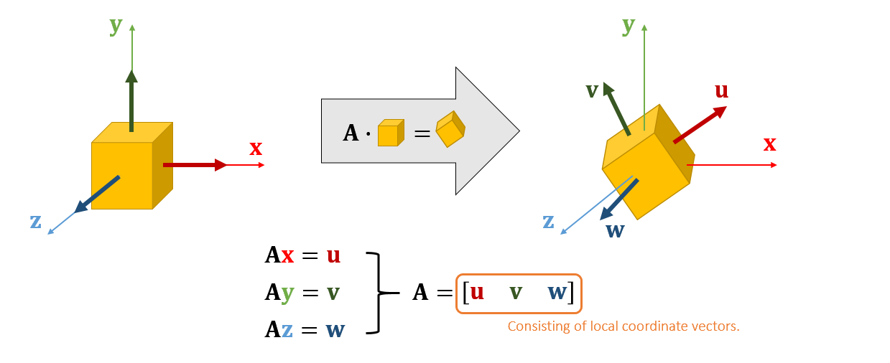

放大缩小，用对角线矩阵；

#### SVD 奇异值分解

$$
A=UDV^T
$$

D是奇异值对角线矩阵；U和V是正交矩阵。

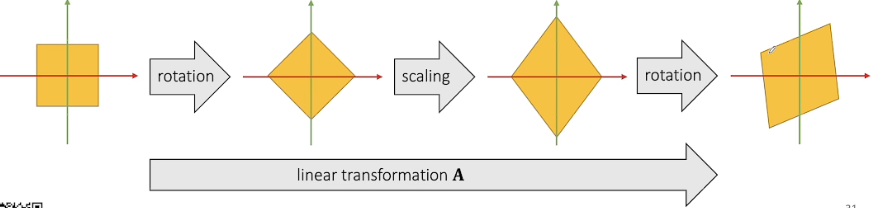

线性形变可以用三个操作描述：旋转+缩放+旋转

**注意：A没有要求**

#### 特征值分解

**A是对称矩阵**
$$
A=UDU^{-1}
$$
U是正交阵，D是特征值对角阵；

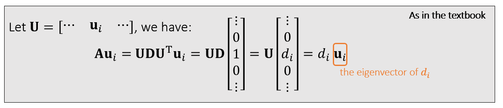

$d_i$即特征值，$u_i$为特征向量

#### 对称正定阵spd

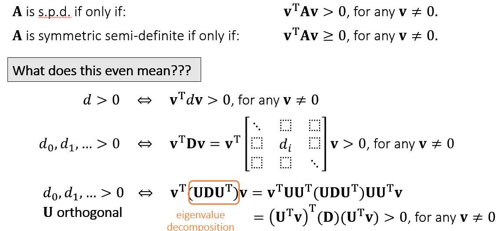

对称正定阵的特征值也都是正的。

实际应用中，对角占优的就是**正定**的；但反之不成立

对称正定阵是可逆的
$$
A^{-1}=(U^T)^{-1}D^{-1}U^{-1}=UD^{-1}U^T
$$
应用于有限元中解线性系统。