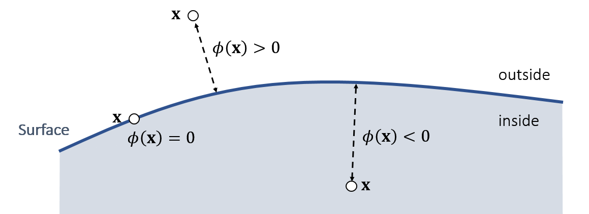

### 带符号距离函数

点到面的距离 **测度**（即点到面上所有点最近的距离）

在外面大于0，在里面小于0

#### 组合面

**交集**：如果在内部（距离都为负），取最大值；在外部，无碰撞，不许考虑

**并集**：在内部（距离都为负），接近最小值；在外部，取最小值

### 碰撞处理

#### 检测到碰撞

下次更新时给一个反向的力

#### 提前检测碰撞

给一个缓冲空间，

#### Log-Barrier penalty Method

迫使力与距离成反比：$f\leftarrow \rho\frac{1}{\phi(x)}\bf{N}$

力$N$是能量$log\phi(x)$的导数。

缺点：穿透后越陷越深，要保证步长足够小

#### Impulse Method

之前计算的力都只在在一个时间起作用

