**没有形变**

### 运动

只有平移和旋转两种运动。

## 平移

两个变量：位置$\bf{x}$和速度$\bf{v}$

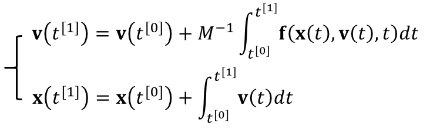

#### 积分方法

显示积分：泰勒展开，就保留前一阶的积分（一阶精度）。

隐式积分：

中点法：关键是二阶部分抵消了，误差是三阶

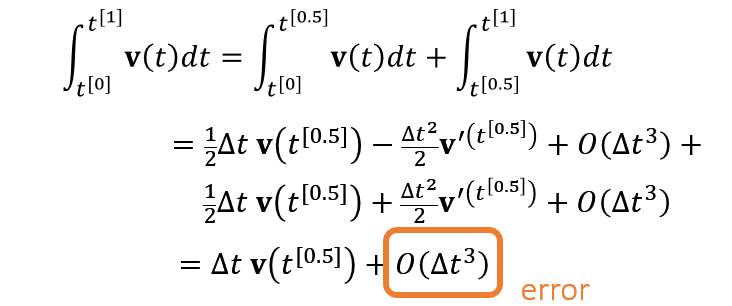

**如何对两个变量积分**？

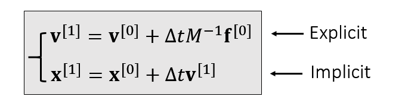

实际上下面不是隐式，因为在上面隐式中已经计算得到了。

**leapfrog method**

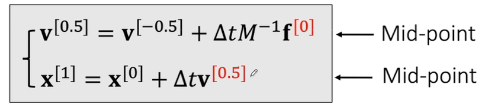

速度与位置错开（交错网格法？）。

#### 受力

重力

空气阻力：$$f_{drag}=-\sigma \bf{v}$$；简化版：$$\bf{v}^{[1]}=\alpha \bf{v}^{[0]}；直接给一个速度阻尼因子

#### 仿真计算

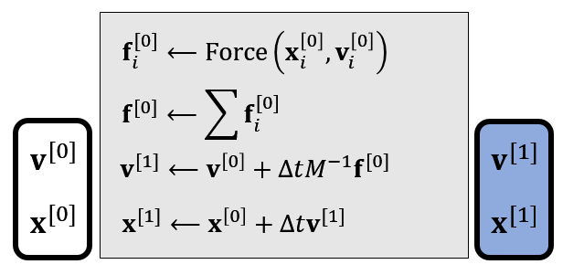

## 旋转

#### 1. 旋转矩阵

3x3的旋转矩阵实际只有3个自由度；不直观；计算角速度时不容易；

表示方法有下面多种：

#### 2. 欧拉角

由三个对着轴的旋转组成；难以计算时间导数；

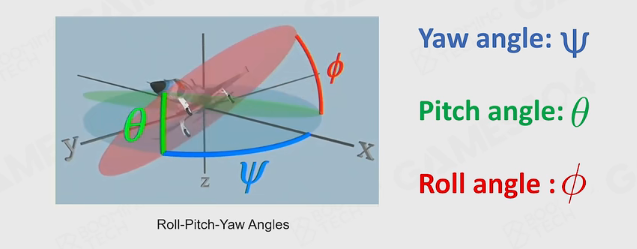

**gimbal lock**：自由度丢失

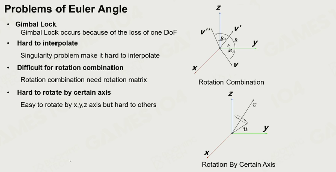

#### 3. Quaternion四元数

复数的优势：借用复数四则运算，运动容易叠加

1个实数和3个虚数（坐标轴）代表：$\bf{q}=[s,\bf{v}]$

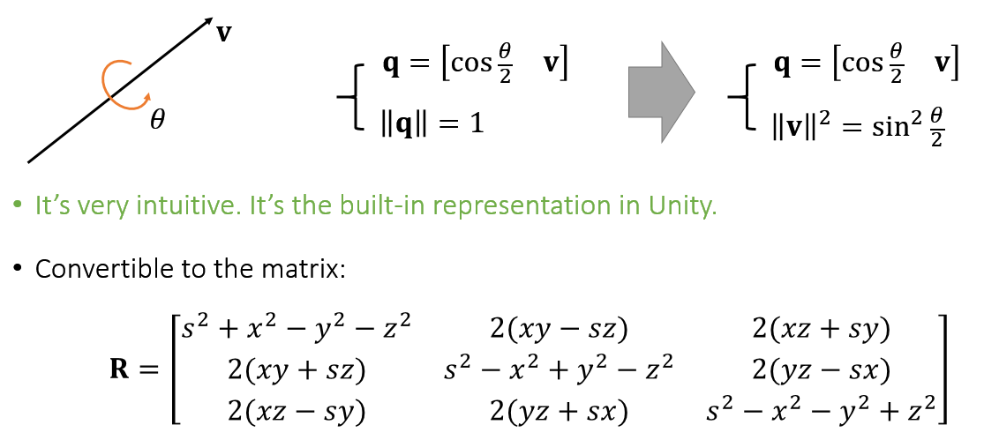

四元数和欧拉角可以相互转换，四元数可以转为旋转矩阵

### 旋转运动

角速度：三维矢量$\bf{\omega}$

#### 力矩和转动惯量

一个刚体对于某转轴的转动惯量决定对于这物体绕着这转轴进行某种角加速度运动所需要施加的力矩。相当于线性动力学中的**质量**。

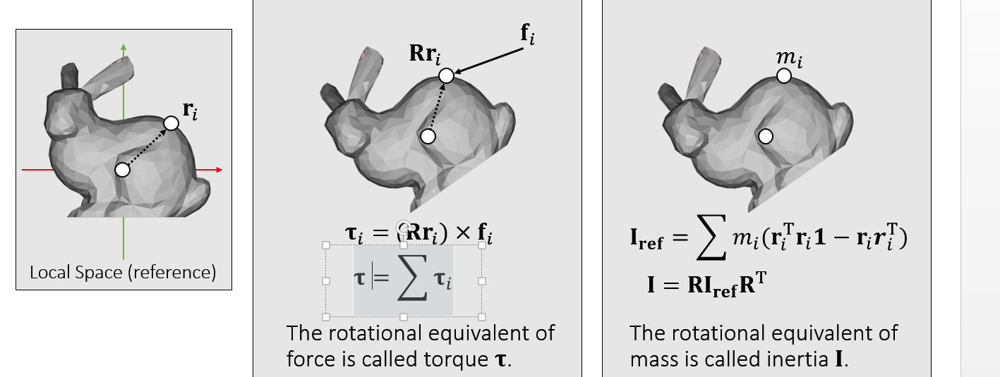

#### 平移和旋转更新

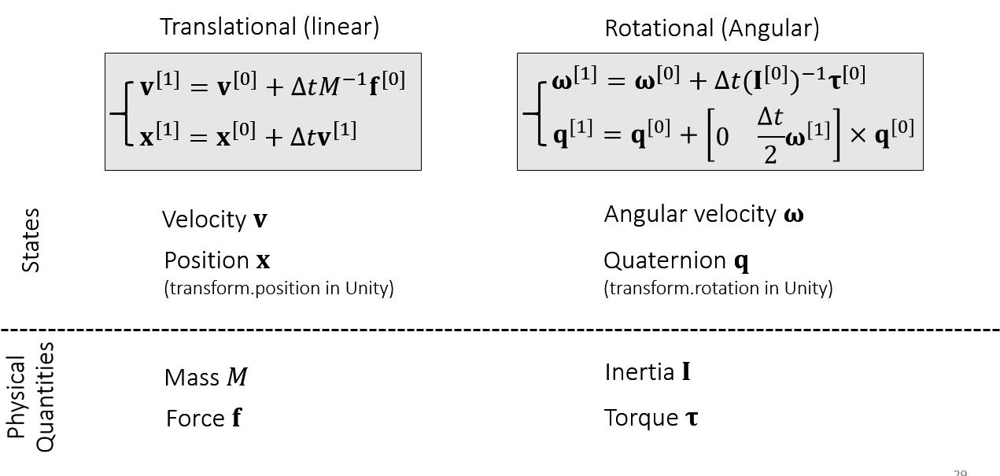

### 仿真过程

#### 力矩

#### 惯性矩阵

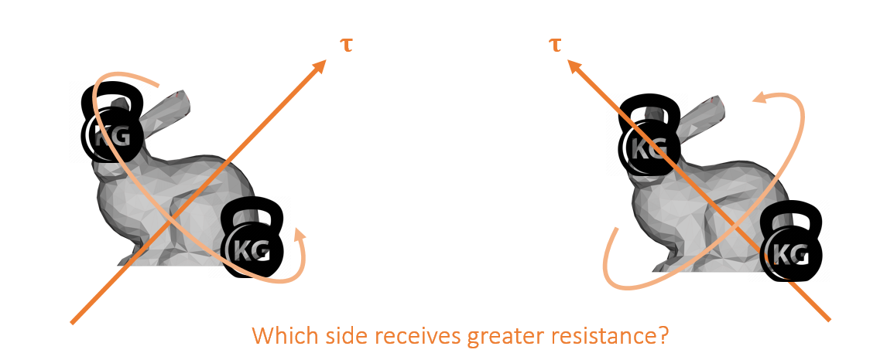

转动后，位置改变，但是可以用参考坐标系下的$\bf{I}$来表示

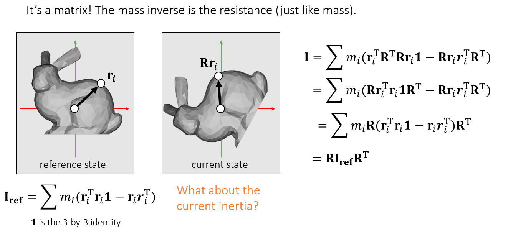

