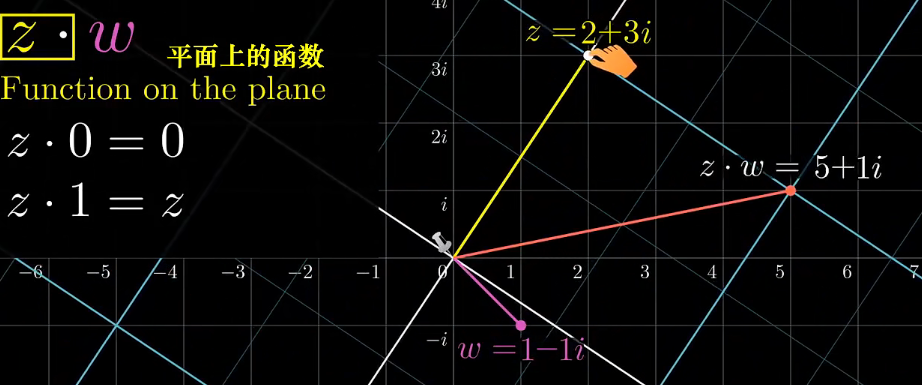
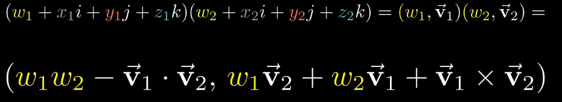
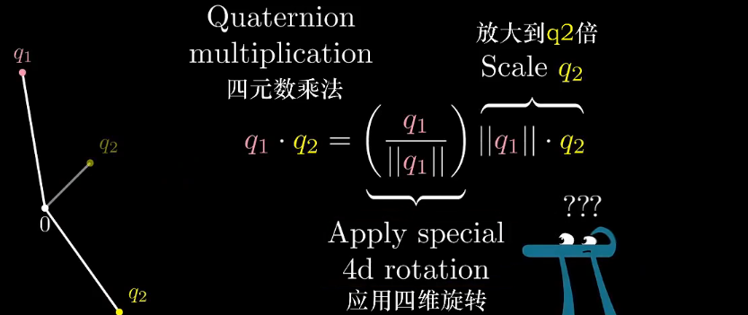

#### 定义

由一个实数和三个叙述组成，即$(1,i,j,k)$四个轴。其中：
$$
i^2=j^2=k^2=ijk=-1\\
ij=-ji=k,\\
jk=-kj=i,\\
ki=-ik=j;
$$

#### 复数的几何意义

$z\cdot w$可以认为是函数$z$对$w$的一种变换操作

### 乘法

**乘上一个单位四元数可以看成是三维空间内两个垂直且同步的二维旋转**

### 单位四元数表示三维旋转的可视化

这里简单解释一下为什么我们用 $qpq’ $的方法表示三维旋转，其中 $p$ 是表示三维空间向量的纯四元数。首先，如果待旋转的向量 $p$ 与单位四元数虚部所表示的旋转轴正交时，我们只需要左乘单位四元数就可以表示此旋转。如下图所示，i 点绕 k 轴进行旋转，左乘单位四元数 $q$ 即可。

可是对于大部分情况，向量 p 和旋转轴并不正交，单单只是左乘单位四元数 q 会在三维空间中有拉伸的效果。注意整个三维空间都是单位超球面的投影，这里的拉伸只不过是投影之后的一种效果罢了。我们用四元数并不关心四维单位超球面的旋转，而是拿它来描述三维空间的旋转，于是我们必须要找到一种不带拉伸效果的四元数运算。人们发现，当右乘 q 的逆时，同方向的旋转会继续进行，而拉伸的效果互相抵消，于是就有了 qpq’ 的表示方法。如果表示一个绕 **u** 轴 θ 度角的旋转， q 则表示为 [cos(θ/2), sin(θ/2)**u**].

参考：[四元数的可视化_哔哩哔哩_bilibili](https://www.bilibili.com/video/BV1SW411y7W1/?from=search&seid=2286694305504614618&spm_id_from=333.337.0.0&vd_source=51835ba198b79c5277a5fcadc11bd9ff)

[可视化理解四元数，愿你不再掉头发 - 腾讯云开发者社区-腾讯云 (tencent.com)](https://cloud.tencent.com/developer/article/1438372)