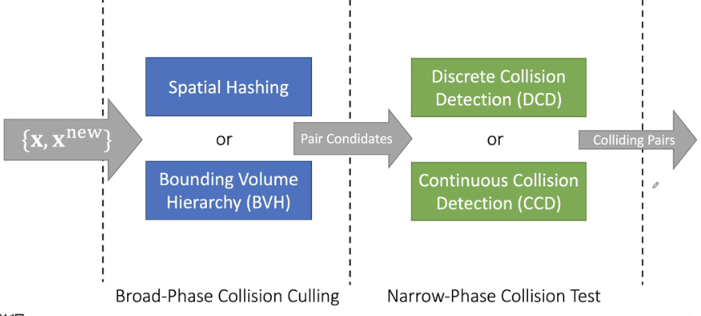
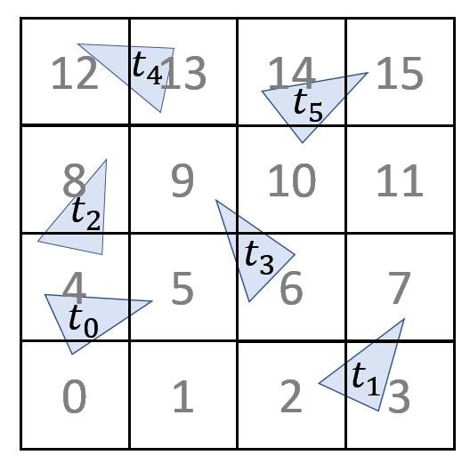
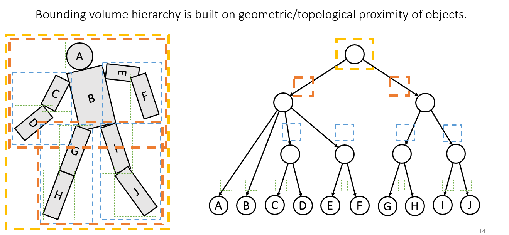

### 碰撞检测流程

## 剔除culling

### 空间划分

检测三角形的位置

### Morton code

加快内存访问，横向是连续，但是纵向不连续。

### 物体划分BVH

#### 包围核

- Axis-aligned bounding box (AABB) 
- oriented bounding box (OBB).

对于形变较少的物体比较有效

### 对比

- 空间划分
  - 容易理解和写代码
  - GPU friendly
  - 计算量较大（每次更新都需要检测）
- BVH
  - 复杂
  - 树形结构，不适于GPU
  - 更新简单，只需更新包围核

## 检测test

实际检测的是相交

 

