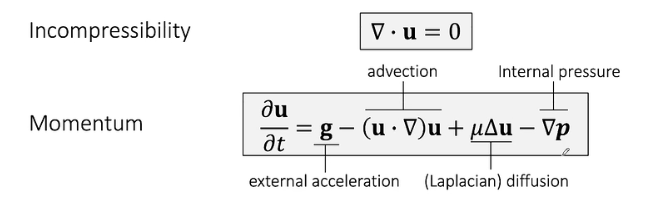
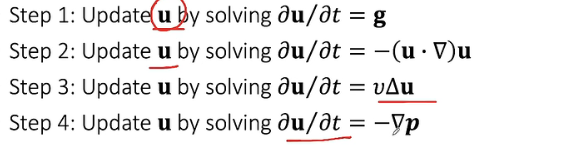
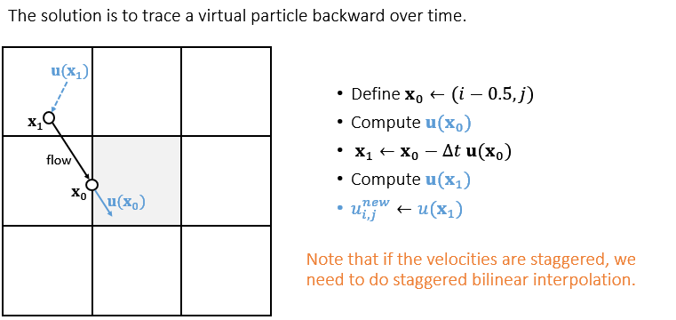
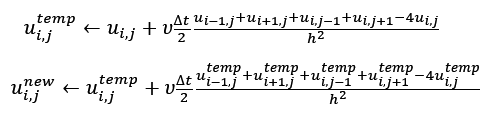

### 欧拉网格

至少要有一个边界条件为Dirichlet条件，否则有无穷解

#### 中心差分的问题

得到的点位置是边界上，所以使用**交替网格**

并且更为直观

#### 双线性插值

### 控制方程

#### 求解方法

Method of Characteristics：对长的偏微分方程分步求解

#### Advection：

由于使用欧拉网格，无法考虑流体运动产生的变化（拉格朗日似乎不考虑这个？）。直接求解问题时会产生不稳定。

#### semi-Lagrangian method

找到前一个位置，用其速度替代当前位置的速度

#### diffusion

为避免时间步长不稳定，可以分2步，或者使用隐式积分

#### pressure

压强是不可压缩导致的

所在在此求解divergence-free equation

## Air and Smoke

