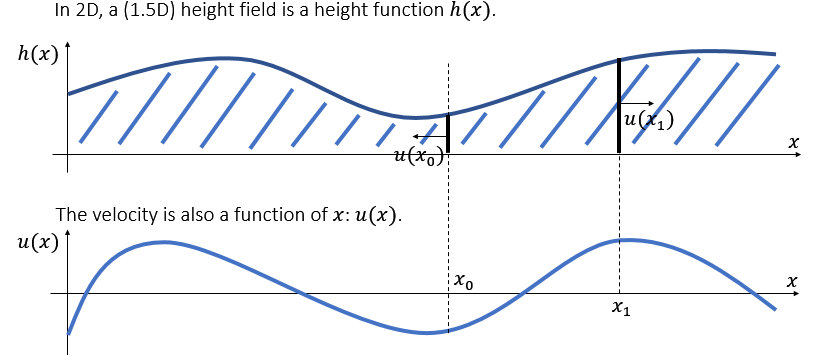
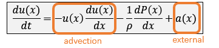
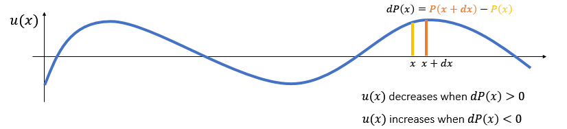
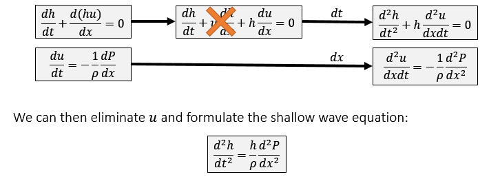
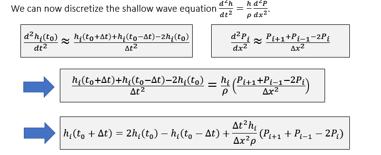
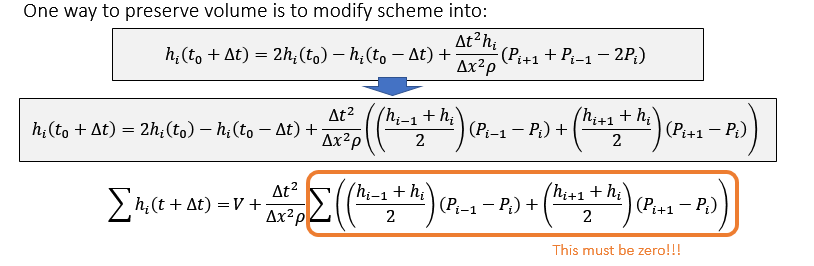
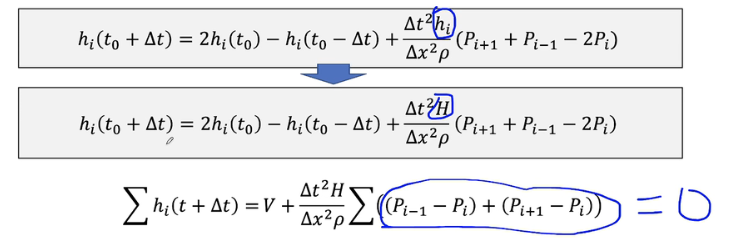
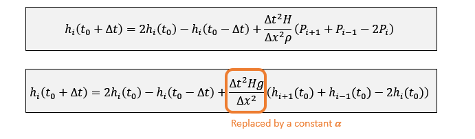
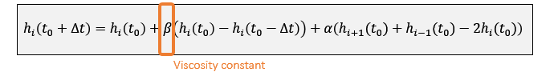

简化计算波

### 高度场

高度场更新：
$$
\frac{dh}{dt}+\frac{d(h(x)u(x))}{dx}=0
$$
h(x)u(x)可以认为是高度通量，在x上的导数应等于高度在单位时间的变化；

速度场更新：

可以简化为：
$$
\frac{du(x)}{dt}=-\frac{1}{\rho}\frac{dP(x)}{dx}
$$
P表示压强

### Shallow Wave Equation

#### 离散化求解

### Volume Preservation

离散产生的问题，需要保证体积不变

#### solution 1

更新中方框的第二项回和第一项抵消。

#### Solution 2

令$h_i$为常数

#### 压强

$P_i=\rho gh_i$带入离散公式

#### 粘度

类似于弹簧的阻尼

加入粘度的公式：

### 边界条件

迪利克雷边界：水流一直流入/出

纽曼边界：假定导数为0，则为硬边界。

### two-way coupling

关键是计算物体进入水的深度。

#### virtual height

把其他介质占据的空间转换为水占的空间