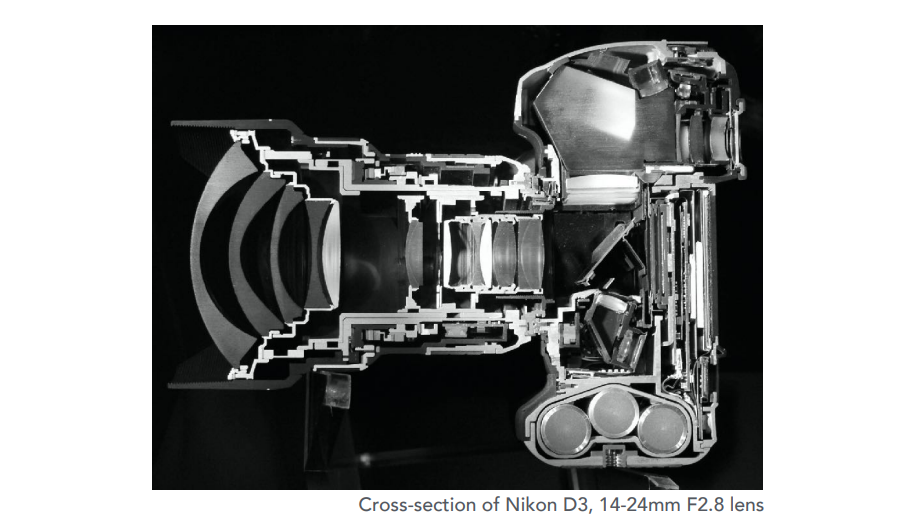
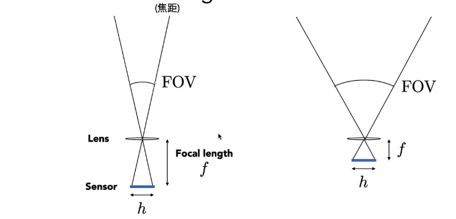

成像 = 合成（光栅化/光线追踪） + 捕捉（动作捕捉/照相）

## 相机

- 针孔成像：没有景深（虚化）
- 棱镜成像

传感器记录的是irradiance。

### FOV 视场

$$
FOV = 2 arctan(\frac{h}{2f})
$$

#### FOV 和 焦距

等效到35mm胶片（h）

一般会固定传感器长度$h$，用焦距$f$定义FOV。

### 曝光

exposure = time x irradianced

- T（time）受快门时间控制
- E（irradiance）
  - 传感器感光度
  - 焦距和光圈大小

#### 快门工作原理

ROlling shutter：快门打开需要一定时间，如果物体运动太快，出现这样的效应。

### 景深

物距点不再相距点上，导致光发散，不再是一个点而是圆