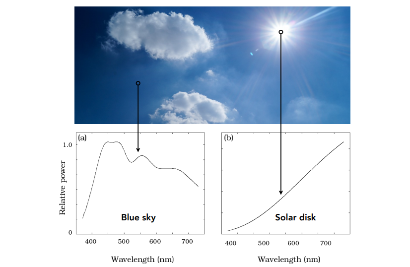
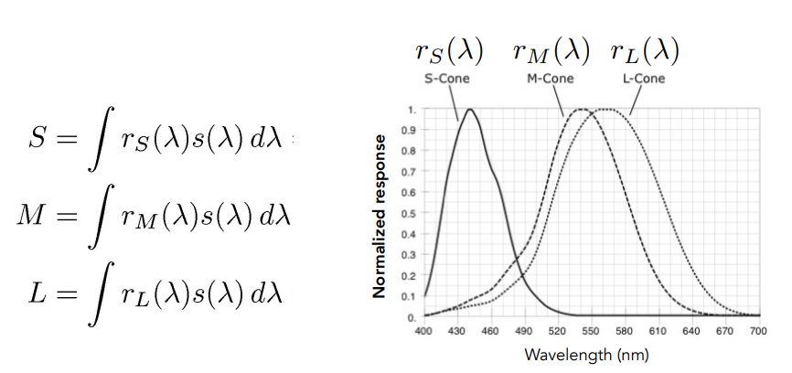

### 全光函数（plenoptic function）

#### 灰度

$P(\theta,\phi)$，(x, y)在球坐标下变为角度

#### 颜色

$P(\theta,\phi,\lambda)$，$\lambda$为光的波长

#### 电影

$P(\theta,\phi,\lambda, t)$

#### 全息电影

$P(\theta,\phi,\lambda, t, V_X, V_Y, V_Z)$，也就是全光函数

### 光场

把irradiance分为各个方向的radiance

用两个平面表示一个四维函数。

#### 光场相机

先拍照，后调整（调焦距等）

记录了光场的所有信息

但是：需要大量的空间分辨率，需要胶片很高的分辨率；高成本，微透镜；

## 颜色

#### 谱功率密度SPD（光谱）

**线性**：

颜色是人眼的感知。

### 感知

视网膜两类细胞：

- Rods：感受光的强度，灰度
- Cones： 感受色彩，分三类；S、M和L，对一个短波、中波、和长波。

最终人眼得到的是：光谱的积分

#### 同色异谱

光谱不同，但积分结果一致。

**应用**：用不同的光谱还原同一个颜色

### 色彩重建

加色系统：RGB；屏幕显示

减色系统：CMKY；打印机

### 色彩空间

standard RGB (**sRGB**)：色域有限

**XYZ**：科研使用；匹配所有颜色，Y近似亮度

XYZ是三维空间，为了可视化（降为二维）

令:
$$
x=\frac{X}{X+Y+Z}\\
y=\frac{Y}{X+Y+Z}
$$
固定Y（即亮度），既可以显示所有的色彩。

**HSV**：色调H：颜色；饱和度S：接近白色还是本色；明度V：接近黑色还是本色；

**LAB**：L：亮度/明度；A：红和绿（互补色）；B：黄色和蓝色（互补色）。互补色是人脑感知的一种概念。

**颜色是对比的**

