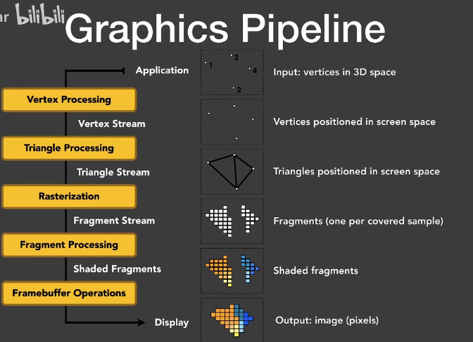
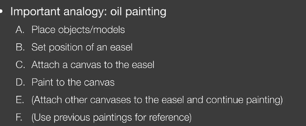
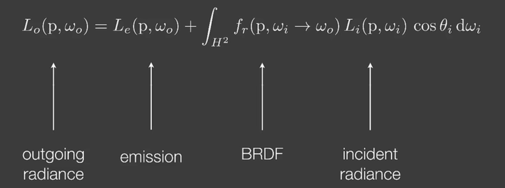
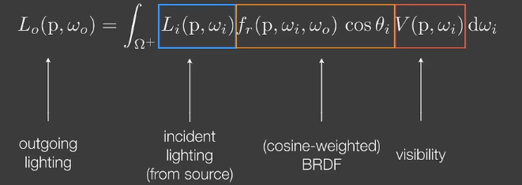

### Graphics Pipeline

### OpenGL

在CPU写的，调度GPU

- 仅是前端，编程语言不重要（C、python）
- 跨平台
- 其他替代项：DirectX、Vulkan

劣势：

- 碎片化：很多不同版本；一直在添加新功能
- C风格，不好用
- 不好debug（之前）

#### 步骤

#### 1.物体摆放

由点到三角形：.obj文件

物体位置平移旋转等

#### 2. set up an easel

视图变换；

framebuffer

#### 3. attach a canvas to the easel

渲染一次、多重缓冲

#### 4. shading/render（核心）

DIrectX：面向对象

引擎：GUI操作

### shading languages

类似C，但更好用一些。

目前流行：HLSL语言in DirectX；GLSL in OpenGL

#### Debug

以前需要Nsight

个人经验：

- 打印出来
- 把值显示为颜色

### 渲染方程

### 实时渲染RTR

实时渲染

- visibility：能否看到各个方向的光照

只需要考虑一次反射