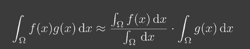

### 1. shadow mapping

2个步骤：

- 从光源出发，得到一个SM
- 配合该SM从相机出发

优势：无需几何关系，直接处理图像

劣势：锯齿、self occlusion

#### 存在的问题

**自遮挡**：由于每个像素记录的深度是一个常数，但在实际三维中该像素的物体并不是常数，而且变化较大（尤其是光线方向接近平行物体），此时会出现这个问题

解决方案：加上一个bias

方案二：second-depth shadow mapping

最大问题：watertight：必须是物体而不能是面

**锯齿/走样**：

动态分辨率

### 数学背景

微积分不等式：

- schwarz不等式

分母：用于归一化

约等号成立条件：

- 积分域小
- g(x)足够光滑（变化范围小）

对于点光源/方向光源，积分限很小

### 2. percentage closer soft shadow

#### percentage closer filtering

抗锯齿

取周围所有的深度做对比，再把所有的布尔值做平均，用平均值作为visibility。

#### 过滤核大小

samll --> sharper

large --> softer

