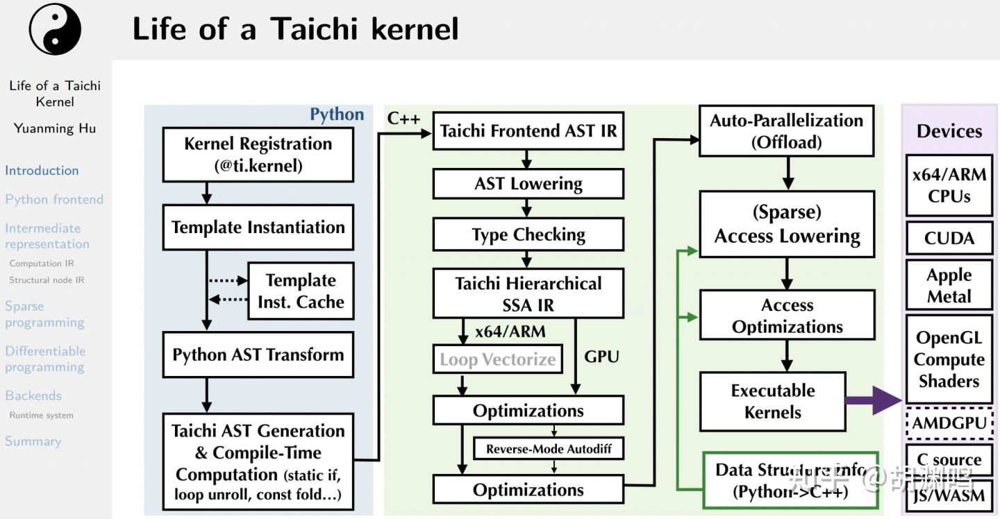

### 1. Taichi的优势

**Taichi 则更适用于并行高性能数值计算、物理仿真以及计算机图形学。**

1. 性能高（加速python，并行for）同时代码编写简单（专门面向计算机图形模拟，进行了优化）
2. 可移植性（原生支持GPU）
3. 数组通用，可以和PyTorch等数据结构衔接。

### 2. Taichi的特点

1. 3D视觉数据通常具有**空间稀疏性 (spatial sparsity)**，他们需要稀疏数据结构以达到高性能。但是，用**传统语言+数据结构库**的方式编写稀疏计算程序是困难的
2. **可微分 (differentiable)** 
3. 使用**低精度 (low-precision)、量化 (quantized)** 的数据类型来节约内存空间与带宽逐渐变得流行，因为 1) GPGPU大行其道，但GPU内存有限 2) 现代处理器FLOPS富余而内存带宽紧缺，并且这两种计算资源的差距正继续拉大。为了同时达到节约内存和高性能，在命令式编程语言中实现对低精度数据格式的**编译器级别**的支持是必要的。

这三个特点刚好对应作者的三篇文章

#### 编译流程

参考：

[Why Taichi (1): 为什么设计新的编程语言？ - 知乎 (zhihu.com)](https://zhuanlan.zhihu.com/p/365307826)

[用 Taichi 加速 Python：提速 100+ 倍！ - 知乎 (zhihu.com)](https://zhuanlan.zhihu.com/p/547123604)

