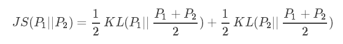

#### 熵

| 序号 | 事件         | 概率p | 信息量I         |
| ---- | ------------ | ----- | --------------- |
| A    | 电脑正常开机 | 0.7   | -log(p(A))=0.36 |
| B    | 电脑无法开机 | 0.2   | -log(p(B))=1.61 |
| C    | 电脑爆炸了   | 0.1   | -log(p(C))=2.30 |

熵其实是信息量的期望值，它是一个随机变量的确定性的度量。熵越大，变量的取值越不确定，越无序。
公式:
$$
H(X)=E[I(x)]=−E[logP(x)]=-\sum_{i=1}^n P(xi)logP(xi)
$$

其中n代表所有的n种可能性，所以上面的问题结果就是

>H(X)=−[p(A)log(p(A))+p(B)log(p(B))+p(C))log(p(C))]
=0.7×0.36+0.2×1.61+0.1×2.30
=0.804

然而有一类比较特殊的问题，比如投掷硬币只有两种可能，字朝上或花朝上。买彩票只有两种可能，中奖或不中奖。我们称之为0-1分布问题（二项分布的特例），对于这类问题，熵的计算方法可以简化为如下算式：
$$
\begin{eqnarray}
H(X)&=&-\sum_{i=1}^n p(x_i)log(p(x_i))&=&-p(x)log(p(x))-(1-p(x))log(1-p(x))
\end{eqnarray}
$$

#### MLE最大似然估计

假定有m个样本，由**未知**的真实数据分布$p(x)$独立生成；

最大似然估计是参数估计的方法之一

给定：模型（概率分布的，由固定但未知的参数），数据集（随机样本）

估计：模型的未知参数

最大似然估计建立在这样的思想上：在一次抽样中，我们求出某个参数能使这个随机样本出现的概率最大，我们把这个参数作为对真实参数的估计。
（最大似然估计的依据就是：概率最大的事件最有可能发生。）
（隐含的思想是：每种参数的先验概率相同或近似）

#### KL散度

也称为相对熵，是两个概率分布P和Q差别的非对称性的度量。 KL散度是用来度量使用基于Q的分布来编码服从P的分布的样本所需的额外的平均比特数。

典型情况下，P表示数据的真实分布，Q表示数据的理论分布、估计的模型分布、或P的近似分布

在机器学习中，P往往用来表示样本的真实分布，比如[1,0,0]表示当前样本属于第一类。Q用来表示模型所预测的分布，比如[0.7,0.2,0.1]
直观的理解就是如果用P来描述样本，那么就非常完美。而用Q来描述样本，虽然可以大致描述，但是不是那么的完美，信息量不足，需要额外的一些“信息增量”才能达到和P一样完美的描述。如果我们的Q通过反复训练，也能完美的描述样本，那么就不再需要额外的“信息增量”，Q等价于P。

$$
D_{KL} (P\|Q)=-\sum _{i}^n P(i)\ln {\frac {Q(i)}{P(i)}}.
$$
等价于
$$
D_{KL}(P\|Q)=\sum _{i}P(i)\ln {\frac {P(i)}{Q(i)}}.
$$

#### JS散度

两个概率分布的相似度，是基于KL散度的变体，解决了KL散度非对称问题

KL散度和JS散度度量的时候都有一个问题：如果两个分布P,Q距离较远，完全没有重叠的时候，KL散度是没有意义的，在学习的时候，这就意味着在这一点的梯度为0，即梯度消失了。

#### 交叉熵

H(P,Q)代表用P的分布表示Q分布的信息，比熵要大。需要更长的编码。并且分布差异越大，需要的编码长度越长。代表冗余编码长度。

对上式变形：
$$
\begin{eqnarray}
D_{KL}(p||q) &=& \sum_{i=1}^np(x_i)log(p(x_i))-\sum_{i=1}^np(x_i)log(q(x_i))\\
&=& -H(p(x))+[-\sum_{i=1}^np(x_i)log(q(x_i))]
\end{eqnarray}
$$
等式的第一步份就是p的熵，后一部分就是交叉熵，所以：
$$
{\displaystyle H(p,q)=-\int _{X}P(x)\,\log Q(x)\,dr(x)=\operatorname {E} _{p}[-\log Q].\!}
$$

#### 交叉熵与KL散度
$$
{H}(p,q)= E_{p}[-\log q]={H}(p)+D_{{{KL}}}(p\|q).
$$

#### KL散度与MLE

最小化KL散度等效于最大似然估计

#### 联合熵

在互信息的讨论中，我们已经涉及到联合分布的概率，联合熵就是度量一个联合分布的随机系统的不确定度，下面给出两个随机变量的**联合熵**的定义：

分布为 $p(x,y)$的一对随机变量 (X,Y) ,其联合熵定义为：
$$
H(X,Y)=-\sum_{x \in \mathcal{X}}^{} \sum_{y \in \mathcal{Y}}^{} {p(x,y)\log p(x,y)}=E\left[ \log\frac{1}{p(x,y)} \right]
$$

#### 边缘熵

#### 互信息

mutual information or MI，或**转移信息**（transinformation）是变量间相互依赖性的量度

一般地，两个离散随机变量 *X* 和 *Y* 的互信息可以定义为：

$$
I(X;Y)=\sum _{{y\in Y}}\sum _{{x\in X}}p(x,y)\log {\left({\frac  {p(x,y)}{p(x)\,p(y)}}\right)},\,\!
$$
当x和y独立时，$p(x,y)=p(x)p(y),因此
$$
\log {\left({\frac  {p(x,y)}{p(x)\,p(y)}}\right)}=\log 1=0.\,\!
$$
此外，互信息是非负的，而且对称

它可以等价地表示成：  
$$
{\begin{aligned}I(X;Y)&{}=H(X)-H(X|Y)\\&{}=H(Y)-H(Y|X)\\&{}=H(X)+H(Y)-H(X,Y)\\&{}=H(X,Y)-H(X|Y)-H(Y|X)\end{aligned}}
$$

其中 $H(x)$和$H(Y)$是边缘[熵](https://zh.wikipedia.org/wiki/信息熵)，*H*(*X*|*Y*) 和 *H*(*Y*|*X*) 是[条件熵](https://zh.wikipedia.org/wiki/条件熵)，而 *H*(*X*,*Y*) 是 *X* 和 *Y* 的[联合熵](https://zh.wikipedia.org/wiki/联合熵)。注意到这组关系和并集、差集和交集的关系类似，于是用Venn图表示。

#### 条件熵

给定随机变量X与Y：在给定X的条件下Y的熵的定义为

$$
{\begin{aligned}\mathrm{H} (Y|X)\ &\equiv \sum _{{x\in {\mathcal  X}}}\,p(x)\,\mathrm{H} (Y|X=x)\\&=-\sum _{{x\in {\mathcal  X}}}p(x)\sum _{{y\in {\mathcal  Y}}}\,p(y|x)\,\log \,p(y|x)\\&=-\sum _{{x\in {\mathcal  X}}}\sum _{{y\in {\mathcal  Y}}}\,p(x,y)\,\log \,p(y|x)\\&=-\sum _{{x\in {\mathcal  X},y\in {\mathcal  Y}}}p(x,y)\log \,p(y|x)\\&=-\sum _{{x\in {\mathcal  X},y\in {\mathcal  Y}}}p(x,y)\log {\frac  {p(x,y)}{p(x)}}.\\&=\sum _{{x\in {\mathcal  X},y\in {\mathcal  Y}}}p(x,y)\log {\frac  {p(x)}{p(x,y)}}.\\\end{aligned}}
$$

**当且仅当Y的值完全由X确定时，Ｈ(Y|X)=0**

当且仅当Y和X为独立随机变量时，H(Y|X)=H(Y)

参考：https://blog.csdn.net/tsyccnh/article/details/79163834

[https://zh.wikipedia.org/wiki/%E4%BA%92%E4%BF%A1%E6%81%AF](https://zh.wikipedia.org/wiki/互信息)

