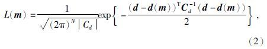
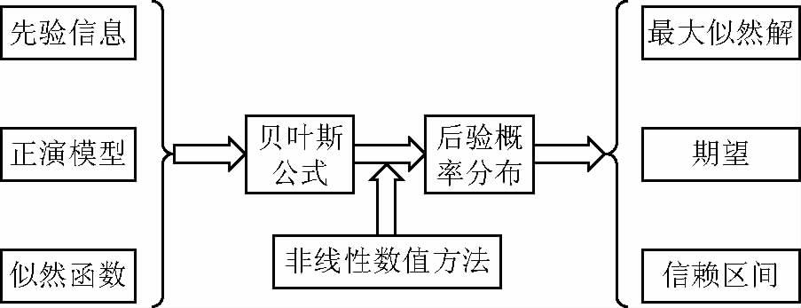

与经典概率公式的区别主要在于对先验信息的利用，

对于模型参数与观测参数的关系，贝叶斯后验概率可以通过先验信息和似然函数给出。
$$
p(m|d)=\frac{p(d|m)p(m)}{p(d)}
$$
其中，d是N维的观测数据，m为M维的模型参数，反演时都被当做随机变量。

p(d)叫归一化常数

p(m)叫模型参数的先验概率密度分布，可以时反演资料的积累或地质信息（大多数时候在没有先验信息的情况下可以假设先验分布为**均匀分布**）

p(m|d)是模型m对于观测数据d的条件概率，也叫后验分布。即统计反演的解。

p(d|m)是似然函数，写作L(m)，常见为多维高斯分布。

d(m)是正演响应，Cd是数据协方差矩阵。似然函数表示d对模型参数m的条件概率，可以理解为已知数据d的情况下随参数*m*变化的函数，它反映了模型与数据的匹配程度.

贝叶斯反演的基本流程如图 1所示，在已知先验信息和似然函数的情况下，利用贝叶斯公式来获得后验分布，根据后验分布就可以获得解的一切信息，包括期望、方差等等统计特征，如取其最大值所对应的那组模型即为最大后验解或最大似然解.

参考：http://html.rhhz.net/dqwlxjz/html/20160313.htm