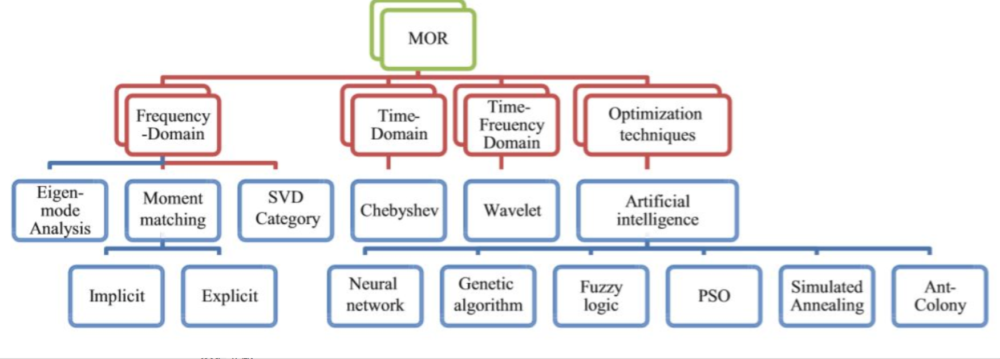

### 1. MOR简介

模型降阶的作用是降低数值模型（ODEs）的阶数，加速模型模型的求解速度，基于机器学习的模型降阶方法是具有很大发展潜力的方向。

MOR代表了一个重要研究领域，它不仅广泛应用于电磁学领域，也应用其领域，比如流体动力学、机械学、计算生物学、电路设计、控制理论、生物医学应用，等等模型降阶的方法在文献(J.R.Koza, 1992)和文献(S. Panda, 2012)中首次提到，在文献(S.N.Sivanandam, 2016)中详细讨论了大型矩阵可以简化为小型矩阵并得到合理的估计。基本的MOR方法在上世纪80年代和90年代大量发表，后来有出现了很多新的MOR方法。所有的MOR方法可以分为5类，分别为频率域方法、时间域方法、频率-时间域方法和优化技术。尽管存在许多的MOR方法，仍有许多问题没法解决，而且，非线性MOR方法（NMOR），以及参数化的MOR方法(PMOR)仍非常不成熟。

参考：https://cloud.tencent.com/developer/news/139075

### 2. 传统线性ROM方法

一般针对线性时不变系统

- Krylov 子空间类方法
- 正交分解
- 积分全等变换和最优化方法
- 等等

这些都是为了把求解矩阵简单化，把大矩阵分解为小矩阵

### 3. 参数化偏微分方程

mapping：$\mu\rightarrow u_{\mu}$

把参数μ映射为solution。分为两种情况：

- μ有多个，p-dimension，但彼此独立（每个都是单值）
- μ是空间分布的。

目前大部分parameter PDE的解都是针对第一种情况

