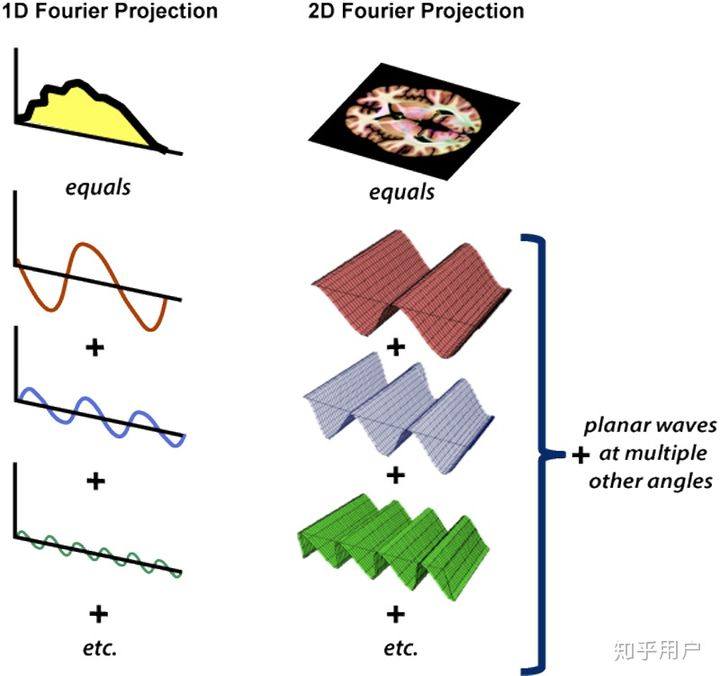

### 1. 一维傅立叶变换

一维信号是一个序列，FT将其分解成若干个一维的简单函数之和。

### 2. 二维傅立叶变换

**二维FT将一个图像分解成若干个复平面波**$e^{j2\pi(ux+vy)}$之和。

公式：
$$
F(u,v)=\int^{+\infty}_{-\infty}\int^{+\infty}_{-\infty}f(x,y)e^{j2\pi(ux+vy)} dxdy
$$
从公式也可以看到，二维傅里叶变换就是将图像与每个不同频率的不同方向的复平面波做内积（先点乘在求和），也就是一个**求在基**$e^{j2\pi(ux+vy)}$的投影过程。

注意结果是对称的，第一个结果是零频率的？

FFT变换后第一条谱线对应的频率成分就是零频，应用傅里叶变换的公式，令w=0，显见对应的值就是直流分量

对一信号做傅立叶级数分解，第一项必为常数项，常数项自然对应的就是直流分量，谱为0频

实际上就是信号的均值，也称直流分量。在许多应用中，做FFT之前，常常需要去均值，这样第一个点就是0了。

参考：[二维傅里叶变换是怎么进行的？ - 知乎 (zhihu.com)](https://www.zhihu.com/question/22611929)

