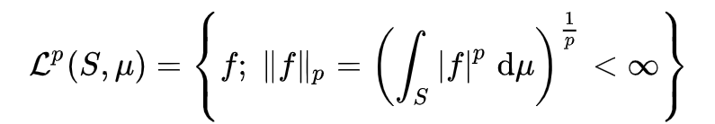
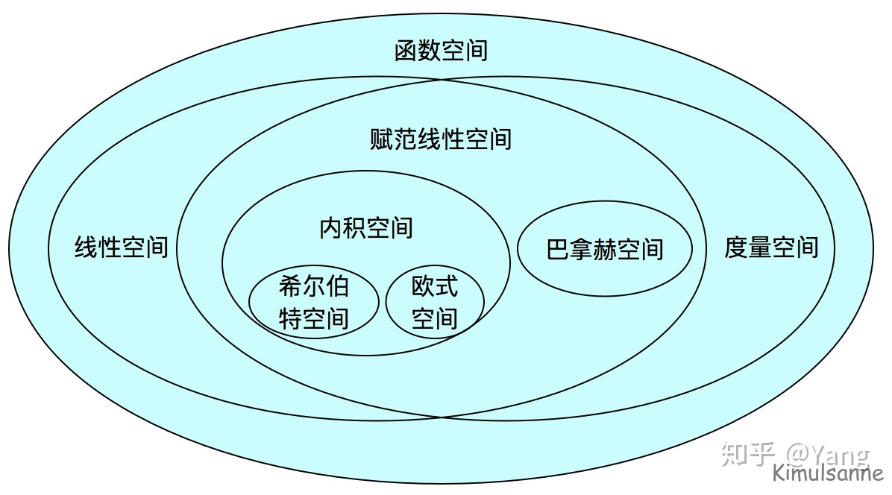

## 1. 数学空间

### 0 . 欧几里得空间

$R^n$

欧几里得空间中最重要的性质也就是**距离**，**内积**和其中**向量所具有的线性**性质

### 1.Sobolev spaces

一个由[函数](https://zh.wikipedia.org/wiki/函数)组成的[赋范向量空间](https://zh.wikipedia.org/wiki/賦範向量空間)，对于某个给定的*p* ≥ 1，它对一个[函数](https://zh.wikipedia.org/wiki/函数)*f*和它的直到某个*k*阶[导数](https://zh.wikipedia.org/wiki/导数)加上[有限](https://zh.wikipedia.org/wiki/有限)[*Lp*范数](https://zh.wikipedia.org/wiki/Lp空间)的这个条件。它以前[苏联](https://zh.wikipedia.org/wiki/苏联)[数学家](https://zh.wikipedia.org/wiki/数学家)[谢尔盖·索博列夫](https://zh.wikipedia.org/wiki/舍蓋·索伯列夫)来命名。

对数学函数光滑性要求有很多种：函数连续，或进一步导数连续（$C^1$)

索伯列夫空间正是 $C^1$​​空间的替代品

### 2. Lp空间

由p次可积分函数组成的空间。在有限元中有应用

当空间维度是无穷而且不可数的时候（没有一个可数的基底），无法运用有限维或可数维度空间的办法来定义范数，但对于可积函数空间，仍然能够定义类似的概念。具体来说，给定[测度空间](https://zh.wikipedia.org/wiki/测度空间)(*S*, *Σ*, *μ*)以及大于等于1的实数*p*，考虑所有从*S*到K上的[可测函数](https://zh.wikipedia.org/wiki/可测函数)。考虑所有绝对值的*p*次幂在*S*可积的函数，也就是集合：

### 3. L∞空间

该空间的元素：区间上除零测集外，**有界** ![[公式]](../imags/equation-16311897584761.svg+xml) **可测函数**全体。

给该空间赋予的范数：

### 4. banach space

尤其是在[泛函分析](https://zh.wikipedia.org/wiki/泛函分析)之中，**巴拿赫空间**（英语：Banach space）是一个[完备](https://zh.wikipedia.org/wiki/完备空间)[赋范向量空间](https://zh.wikipedia.org/wiki/賦範向量空間)。更精确地说，巴拿赫空间是一个具有[范数](https://zh.wikipedia.org/wiki/范数)并对此范数[完备](https://zh.wikipedia.org/wiki/完备空间)的[向量空间](https://zh.wikipedia.org/wiki/向量空間)。其完备性体现在，空间内任意向量的[柯西序列](https://zh.wikipedia.org/wiki/柯西序列)总是收敛到一个良定义的位于空间内部的[极限](https://zh.wikipedia.org/wiki/极限)

### 5. 希尔伯特空间

希尔伯特空间是有限维[欧几里得空间](https://zh.wikipedia.org/wiki/欧几里得空间)的一个推广，使之不局限于实数的情形和有限的维数，但又不失完备性（而不像一般的非欧几里得空间那样破坏了完备性）。

数学家们定义：如果**一个空间**是**线性的**，**完备的**，并且**规定了范数**，**内积**和**距离**的，就叫做希尔伯特空间

下面给出一些空间之间的关系：

> 集合 + 距离 = **度量空间**
> 集合 + 线性 = **线性空间**
> 线性空间 + 范数 = **赋范线性空间**
> 赋范线性空间 + 内积 = **内积空间**
> 内积空间 + 完备 = **希尔伯特空间**
> 赋范线性空间 + 完备 = **巴拿赫空间**

​	

## Sobolev norm

$$\|u\|_{H^1(\Omega)} = \sqrt{\int_\Omega |u(x)|^2 \, dx + \int_\Omega |u'(x)|^2 \, dx}$$

