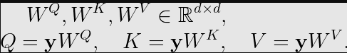
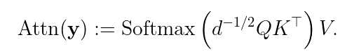
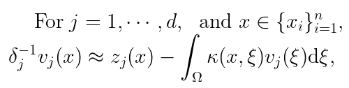
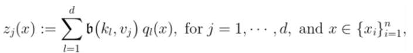
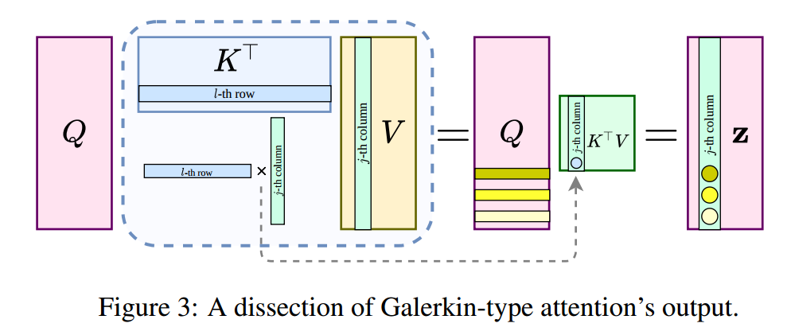
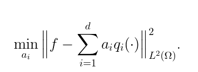
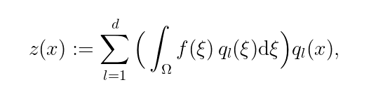

半理论半实践的结果

试图**用希尔伯特空间近似方法中的Galerkin法来解释attention机制**

### 注意力机制self-attention

首先定义三个量Q、K、V

**** 

**dot-product attention：**

将解释从row-wise到column-wise

#### 数学解释

没有softmax， *(QKᵀ)V*with some caveats on the skip-connections可以视为Fredholm方程的第二种形式：

**注**：费雷德霍姆积分方程是一种积分方程的形式，其第二类通常用于迭代求解

$$f(x)=g(x)+\lambda\int^b_aK(x,y)f(y)dy$$​​

迭代法：
$$
f_0(x)=g\\
f_1(x)=g(x)+\int^b_aK(x,y)f_0(y)dy\\
...
$$

如果假定Q、K、V是独立函数，没有softmax，我们视为Petrov-Galerkin projection

函数b是双线性形式定义在无限希尔伯特空间；

我们可以考虑QR分解，或d维正交基函数${q_j(\cdot)}_{j=1^d}$​

[Galerkin Transformer: A One-Shot Experiment at NeurIPS 2021 | by Shuhao Cao | Towards Data Science](https://towardsdatascience.com/galerkin-transformer-a-one-shot-experiment-at-neurips-2021-96efcbaefd3e)

[Galerkin Transformer: A One-Shot Experiment at NeurIPS 2021 - An Amateur Computational Mathematician (scaomath.github.io)](https://scaomath.github.io/blog/galerkin-transformer/)

