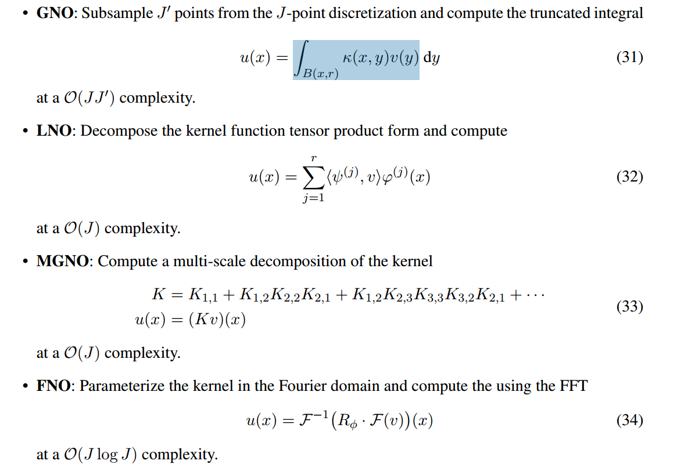
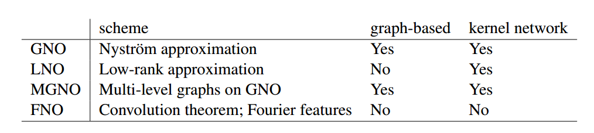
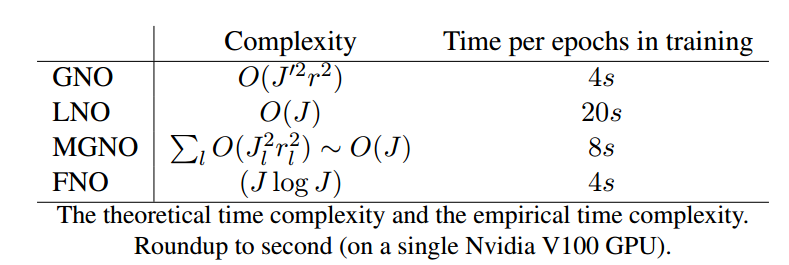
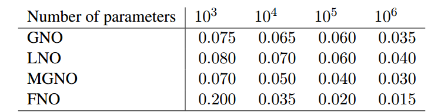

## 0. 摘要

neural operator结合了**线性积分算子**和**非线性的激活函数**，可以用来近似非线性复杂算子。

对比四种神经网络算子：

- graph-based operators, 

- low-rank operators，
- multipole graph-based operators
- Fourier operators  

## 1. 介绍主要概念

在偏微分方程中，**控制方程是局部定义的，而解算子具有非局部特征，可以用积分算子来描述（或者谱域的相乘）**；卷积就是一个很好的例子。

在积分方程中，the graph approximations of Nystrom type  以a consistent way  把不同grid数据联系起来。

**关键**：

1.  神经算子是一种在两个无限维空间的映射网络（传统神经网络是有限维之间的映射）
2. 不同离散化都是用相同的参数（原来的神经网络参数与离散化相关）
3. 近似理论，保证足够近似任何映射
4. 比较了实际使用的四种不通过神经算子

**相关工作**：

有限维算子：CNN，U-net

DeepONet：根据Chen，1995的理论发展，两个分支网络：一个branch net  对应输入，一个trunk net  对应querying locations。

PINNs：

Hybrid solvers：结合传统方法

Reduced basis methods  ：我们的方法和它类似。引入了一个单层网络应对不同的离散化；同时可以transfer不同meshes的解；

Continuous neural networks  ：计算效率不高？

GNO：GNN也用来模拟分子运动，和固体系统，因为这些问题有graph interpretation。但是当mesh size增加时无法获得非局部依赖性。

LNO：a product of two factor networks  

MGNO：应对长期作用+多尺度机构，类似经典的 fast multipole methods；假定长期作用衰减很快，FMM把核矩阵非结尾不同range和分级的low-rank结构，对应long-range components  。但是要求nested grids  和显式pde

FNO：通用近似理论，曾被加速CNN，

## 2. 算子

### 2.1 问题设置

loss

### 2.2 离散化

independent of the discretization  

## 3. 网络结构

1. lifting to its **first** hidden representation  （升维）
2. 迭代核积分：一个局部线性算子，一个非局部积分核算子和一个偏置函数；
3. projection： map last hidden representation to output function。（降维）

和传统FNN的区别：算子直接定义在函数空间而不依赖于离散化？？也就是第一步lift把数据映射到非局部空间，然后被之后的积分核算子学习到特征。

## 7. 数值结果

### 7.4 对比四种方法

#### 7.4.1 ingenuity

LNO和FNO没有sampling？笔使用graph library的GNO和MGNO更快。

#### 7.4.2 表达性

GNO通常由高精度，但受到sampling制约。LNO只对一维有效，二维不能通过sampling加速；FNO是唯一可以应对N-S方程的

#### 7.4.3 复杂性

#### 7.4.4 可改进性

由于GNO、LNO、MGNO都有kernel network，误差不随参数变化，即只需要很小的参数。而FNO许哟啊大量参数。

## 8. 未来方向

参考：

Neural Operator: Learning Maps Between Function Spaces 